```{r echo = FALSE, message=FALSE, warning=FALSE}
library(shiny)
library(bslib)
library(tidyverse)
library(DT)
library(plotly)
library(leaflet)
library(sf)
library(lubridate)
library(bsicons)
library(scales)
```

# Setup

In this session, we’ll build a Shiny app step by step, exploring what Shiny can do - from basic reactive plots to interactive tables, maps, and advanced UI elements. Each section includes **explanatory text**, demo **code**, and **exercises** for you to try.

::: callout-important
**Before you begin:**

-   Ensure you have your **RStudio Project** open or create a new one for this tutorial: open RStudio \> `file` \> `New Project` \> `New R Project` \> select and appropriate location e.g. `./Box/fellowship-retreat-2025/` and name e.g. `dashboard-tutorial` \> `Create Project`

-   We are going to be using a new dataset for this tutorial - it's an example extract from DHIS2 for Zambia that has more indicators for us to work with, download the data (dhis2 data, shapefiles and a population dataset) [here](dhis2-dashboard-clean.zip), and extract the files into a sensible folder in your project e.g. `./Box/fellowship-retreat-2025/dashboard-tutorial/data-clean/`.

-   This tutorial is really aiming to start teaching you the building blocks of Shiny Dashboarding - there is so much you can do and really you can let your creativity flow, if there is a vision you have for a dashboard there will be a way to build it!

-   A great place to start with any dashboard is sketching out on paper what you want your dashboard to look like, write out key functionality for the user and use this as a reference sheet when you start implementing each of these features.
:::

## Required Packages

Reminder to ensure you have installed these packages if you don't have them already using the code below in the console:

```{r eval = FALSE}
install.packages("shiny")
install.packages("bslib")
install.packages("tidyverse")
install.packages("DT")
install.packages("plotly")
install.packages("leaflet")
install.packages("sf")
install.packages("lubridate")
install.packages("bsicons")
install.packages("scales")
```

These packages will allow us to do the following:

-   **`shiny`**: core package to build apps.

-   **`bslib`**: theming (Bootstrap customization) and modern dashboard design elements.

-   **`tidyverse`**: data wrangling (dplyr, ggplot2, readr…).

-   **`DT`**: interactive tables.

-   **`plotly`**: interactive plots.

-   **`leaflet`** & **`sf`**: mapping spatial data.

-   **`lubridate`**: for dealing with date-time.

-   **`bsicons`**: for using Bootstrap icons in Shiny.

-   **`scales`** for formatting numeric values

::: callout-tip
**Tips for this tutorial**

-   After each step of the tutorial ensure you press **▶ Run App or 🔃 Refresh App** to visualise your changes

-   When copying code from the materials at each stage ensure we are **replacing existing code** with the **updated version** this ensures we aren't duplicating code in our application script. This will become clearer as we work through the materials.

-   Sometimes cleaning the environment or restartng R can be helpful when if your app isn't updating with changes.

-   To check the definition, usage and arguments of functions type ? followed by the function name in the Console e.g. `?value_box`.

-   When designing a Shiny App - *always think about the end user* and their journey through the application.
:::

## Set up App Skeleton

Open up a new R script and save it as `app.R` in your main project folder.

Copy the code below which is a demo app that is built into the `Shiny` package.

```{r eval = FALSE}

# packages
library(shiny)

# Define UI for application that draws a histogram
ui <- fluidPage(

    # Application title
    titlePanel("Old Faithful Geyser Data"),

    # Sidebar with a slider input for number of bins 
    sidebarLayout(
        sidebarPanel(
            sliderInput("bins",
                        "Number of bins:",
                        min = 1,
                        max = 50,
                        value = 30)
        ),

        # Show a plot of the generated distribution
        mainPanel(
           plotOutput("distPlot")
        )
    )
)

# Define server logic required to draw a histogram
server <- function(input, output) {

    output$distPlot <- renderPlot({
        # generate bins based on input$bins from ui.R
        x    <- faithful[, 2]
        bins <- seq(min(x), max(x), length.out = input$bins + 1)

        # draw the histogram with the specified number of bins
        hist(x, breaks = bins, col = 'darkgray', border = 'white',
             xlab = 'Waiting time to next eruption (in mins)',
             main = 'Histogram of waiting times')
    })
}

# Run the application 
shinyApp(ui = ui, server = server)

```

This is a simple demo that generates an app with a slider `sliderInput` to determine the number of bins on the corresponding histogram plot. You can see with just a few lines of code how easy it is to generate an interactive application!

-   When you run this with **Run App** in RStudio, Shiny launches a local web app that you can also `Open in Browser`.

-   **Reactivity**: When an input changes, reactive code re-executes and updates outputs automatically.

Lets close this app and go ahead and build own now!

# Part 1: Shiny Building Blocks

## Anatomy of a Shiny App

A **Shiny app** has two key components:

1.  **`UI`** (User Interface): defines what users see and interact with: inputs (dropdowns, sliders) and outputs (plots, tables, text). It controls the layout and appearance of your app.

2.  **`Server`**: R code that reacts to user inputs, runs computations, and sends rendered outputs to the UI. It contains the instructions that your computer needs to build your app

3.  Finally the `shinyApp()` function creates the application objects from our explicit UI/server pair.

Lets remove the contents of the **UI** and **Server** code from the default application and include our required packages at the top of the script - **ensure this is written outside of the `ui` and `server` functions** like this:

```{r eval = FALSE}
#-packages needed---------------------------------------------------------------
library(shiny)
library(bslib)
library(tidyverse)
library(DT)
library(plotly)
library(leaflet)
library(sf)
library(lubridate)
library(bsicons)
library(scales)

#-Define UI for application - User Interface------------------------------------
ui <- fluidPage(
  
)

#-Define server logic - Computations-------------------------------------------- 
server <- function(input, output) {
  
  # reactive expressions, computations and render functions
}

#-Run the application-----------------------------------------------------------
shinyApp(ui = ui, server = server)
```

## Setting up an Empty Layout

For this tutorial we will focus on building our Shiny app using [`bslib`](https://rstudio.github.io/bslib/index.html), a modern UI toolkit that gives your app a clean and responsive layout with minimal effort.

We'll begin by setting up a basic dashboard skeleton - no data or inputs yet - just the layout structure using `bslib::page_sidebar()`.

This gives us a two-pane layout:

-   A sidebar (on the left) for inputs or filters

-   A main content area (on the right) for plots, tables, or summaries

Add the following code into the `ui` section of your `app.R` file :

```{r eval = FALSE}

#-Define UI for application - User Interface------------------------------------
ui <- page_sidebar(
  title = "My Dashboard",  # Title shown in the top bar
  
  sidebar = "Sidebar",     # Placeholder sidebar content
  
  "Main content area"     # Placeholder for main content (e.g., plots or tables)
  
)

```

::: column-margin
**What This Does**

| Component | Description |
|------------------------------------|------------------------------------|
| `page_sidebar()` | Creates a full-page layout with a sidebar + main area |
| `title = "..."` | Sets the page title shown in the app’s header bar |
| `sidebar = "..."` | Placeholder content for the sidebar (we’ll replace this with inputs soon) |
| `"Main content area"` | Text shown in the main panel (this will later become plots and tables) |
:::

Click **Run App** in RStudio. You’ll see:

-   A header bar with the title

-   A left-hand sidebar with the word *Sidebar*

-   A main panel with the text *Main content area*

🎉 That’s your first `bslib` layout up and running!

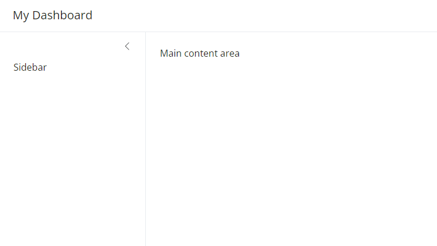

You can add additional elements to the main panel of the page by supplying them to `page_sidebar`.

By default, the sidebar panel will appear on the left side of your app. You can move it to the right side by giving `sidebar` the optional argument `position = "right"`.

💻 **Try this now**

`page_sidebar` creates a sidebar layout that fills the page, and is a quick way to create a page with a sidebar. If you’d like to create a floating sidebar layout that can appear anywhere on the page, and grows with our content use `page_fluid` and `layout_sidebar`.

```{r eval=FALSE}
# Floating sidebar layout
ui <- page_fluid(
  
  layout_sidebar(
    sidebar = sidebar("Sidebar"), # sidebar elements
    
   "Main contents" # Main pannel elements
  )
)

```

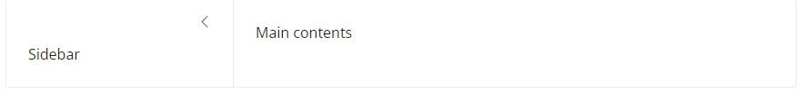

You'll notice here that the side bar and main contents panes are much smaller now, this is because `page_fluid()` allows the contents to scale to the required window size to fit the content.

Shiny also allows for more complex layouts too including options for example, `page_navbar` creates a multi-page user interface that includes a navigation bar. This layout is great for multistage analysis or reporting.

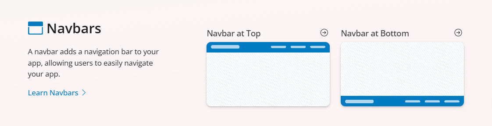

Another option for creating multipage dashbaords is through tabs:

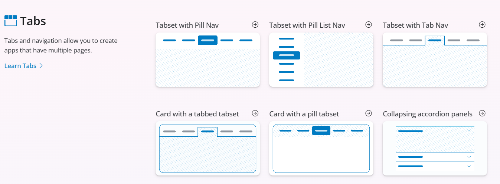

> We will stick to using a single page app today but everything we learn can be applied to controlling multipage apps in the future!

## Layout Elements

### `Cards()`

Now we have our sidebar and main panel, we can also add containers to the main panel that will house each of our data visualisations, `cards()` are a common organising unit in modern dashboards.

You can use the function `card()` to create a card in your Shiny app. `card()` creates a regular container with borders and padding.

Replace your `ui` code with the following:

```{r eval = FALSE}
# Floating sidebar layout
ui <- page_fluid(
  layout_sidebar(
    sidebar = sidebar("Sidebar"),
    "Main contents", 
    # including a card container in the main panel
    card(
      height=400 # setting the height of the card to ensure we can see it when empty.
    )
  )   
)
```

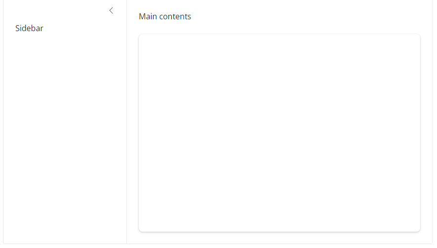

Use cards to present grouped and related information. Add content to a card by supplying arguments to the `card()` function.

Card item functions create various different parts to the card:

-   `card_header()` - A header (with border and background color) for the `card()`. Typically appears before a `card_body()`.

-   `card_footer()` - A header (with border and background color) for the `card()`. Typically appears after a `card_body()`.

-   `card_body()` - A general container for the "main content".

### Exercise 1

1.  Use the above elements to add a `card_header()`, `card_footer()` and `card_body()` to our current application - **Hint:** try adding some plain text in " " to each of the elements.

::: {.callout-tip collapse="true" title="Show Solution"}
```{r eval=FALSE}
# inclduing card elements
ui <- page_fluid(
  layout_sidebar(
    sidebar = sidebar("Sidebar"),
    "Main contents", 
    card(
      height=400, #height set to 400 pixels
      card_header("A Header"), # add a header
      card_body("Card Body"),  # add main body 
      card_footer("A Footer")  # add footer
    )
  )   
)

```

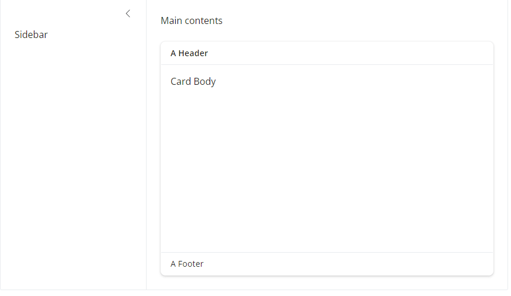
:::

> We'll be using `cards()` alot in this tutorial to house the elements of our dashboard. See the `bslib` [Cards article](https://rstudio.github.io/bslib/articles/cards/?_gl=1*b31cr8*_ga*MzI4NDUyMTQwLjE3MTU4NDE0Mjg.*_ga_8QJS108GF1*czE3NTAzNzY0NzckbzM5JGcxJHQxNzUwMzc2ODI1JGo0OCRsMCRoMA..*_ga_2C0WZ1JHG0*czE3NTAzNzY0NzckbzUyJGcxJHQxNzUwMzc2ODI1JGo0OCRsMCRoMA..) to learn more about cards.

### `value_boxes()`

Value boxes are another useful UI component. Use value boxes to highlight important values in your app.

Create a value box with the function `value_box()`.

A [`value_box()`](https://rstudio.github.io/bslib/reference/value_box.html) has 4 main parts:

1.  `value`: Some text value.

2.  `title`: Optional text to display above `value`.

3.  `showcase`: Optional UI element(s) to display alongside the value.

4.  `theme`: Optional theme to change the appearance of the value box.

5.  `...`: Any other text/UI elements to appear below `value`.

```{r eval = FALSE}

ui <- page_fluid(
  
  #-layout------------------------
  layout_sidebar(
    
    #-sidebar---------
    sidebar = sidebar("Sidebar"),
    
    #-main pannel content----
    "Main contents", 
    
    # Value Box     
    value_box(
      title = "Value box", # Title
      value = 750          # Value to show 
    ),
    
    # Card 
    card(
      height=400, 
      full_screen = TRUE, 
      card_header("A Header"), 
      card_body("Card Body"), 
      card_footer("A Footer")
    )
  )   
)
```

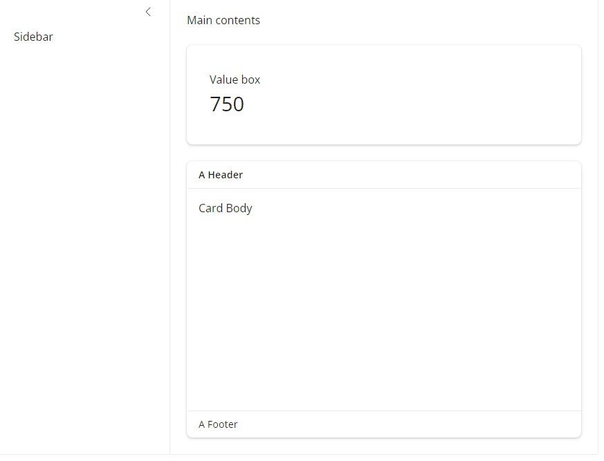

To make our value boxes stand-out even more we can enhance their appearance through setting their theme colour and including inforgraphic icons.

```{r eval=FALSE}
value_box(
      title = "Value box", # Title
      value = 750,         # Value to show
      showcase = bsicons::bs_icon("laptop"), #include an icon
      theme = "pink" # change the box theme colour
    ), 
```

::: column-margin
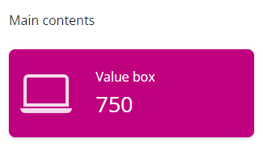
:::

::: callout-note
Note: to use Bootstrap icons, use the function [`bsicons::bs_icon()`](https://rstudio.github.io/bsicons/reference/bs_icon.html)

Check out the library of avaliable icons [here](https://icons.getbootstrap.com/)

We can change the location of `value_boxes()` using the `showcase_layout()` arguement - options include `"left center"`, `"top-right"`. or `"bottom"`
:::

### Exercise 2

2.  Add an addiditional `value_box()` and `card()` to your current dashboard. Set the `card()` to a different height and choose a new icon, theme and icon placement for the addiditional `value_box()`
    -   **Hint:** Bootstrap's theme colors are drawn from [a second color list](https://getbootstrap.com/docs/5.3/customize/color/#all-colors) that includes variations on several main colors, named literally. These colors include `"blue"`, `"purple"`, `"pink"`, `"red"`, `"orange"`, `"yellow"`, `"green"`, `"teal"`, and `"cyan"`.

::: {.callout-tip collapse="true" title="Show Solution"}
```{r eval = FALSE}
ui <- page_fluid(
  
  #-layout------------------------
  layout_sidebar(
    
    #-sidebar---------
    sidebar = sidebar("Sidebar"),
    
    #-main pannel content----
    "Main contents", 
    
    # Value Box     
    value_box(
      title = "Value box", # Title
      value = 750,         # Value to show
      showcase = bsicons::bs_icon("laptop"), #include an icon
      theme = "pink" # change the box theme colour
    ), 
    
    # second value box 
    value_box(
      title = "Value box 2", 
      value = 1993, 
      showcase = bsicons::bs_icon("calendar"), 
      showcase_layout = "top right", 
      theme = "blue" 
    ), 
    
    # Card 
    card(
      height=400, 
      full_screen = TRUE, 
      card_header("A Header"), 
      card_body("Card Body"), 
      card_footer("A Footer")
    ), 
    
    # Second card box 
    card(
      height = 200, 
      full_screen = TRUE,
      card_header("Another Header"), 
      card_body("Another Card"), 
      card_footer("Another Footer")
    )
  )   
)

```

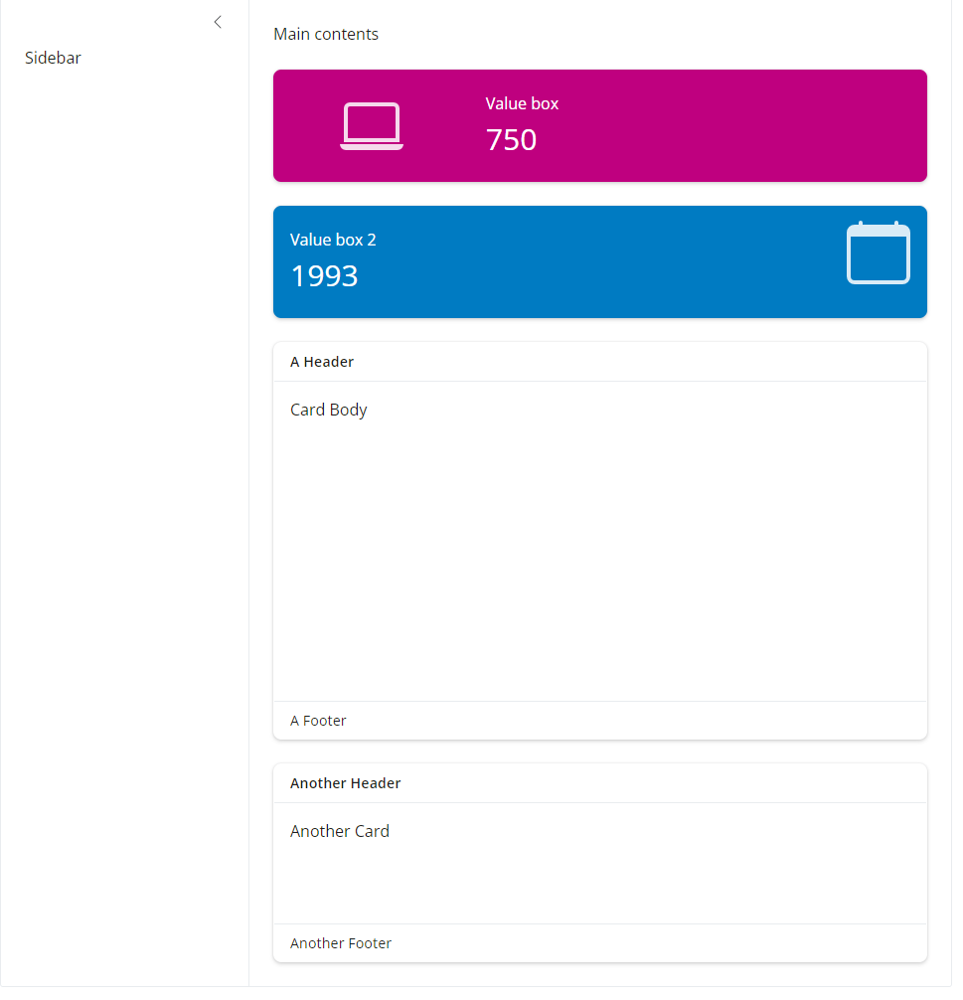
:::

## Adjusting Layout Positions

By default, when you add multiple elements to your main panel, Shiny will place them one after another vertically (i.e., one long column). But as we build real dashboards, we often want to organize elements *horizontally* or into *grids* to create a cleaner and more informative user interface.

This is where layout functions like `layout_columns()` and `layout_column_wrap()` come in.

### `layout_columns()`

The function `layout_columns()` allows you to place elements next to each other, specifying how many columns wide each element should be. Shiny divides the available space into 12 columns . You can assign any number of columns to each element, as long as they add up to 12 or less.

Let’s try moving our two value boxes side by side:

```{r eval = FALSE}
# Value Boxes in a single row
layout_columns(    
    value_box(
      title = "Value box", # Title
      value = 750,         # Value to show
      showcase = bsicons::bs_icon("laptop"), #include an icon
      theme = "pink" # change the box theme colour
      ), 
    
    value_box(
      title = "Value box 2", 
      value = 1993, 
      showcase = bsicons::bs_icon("calendar"), 
      showcase_layout = "top right", 
      theme = "blue" 
      )
    ), 

```

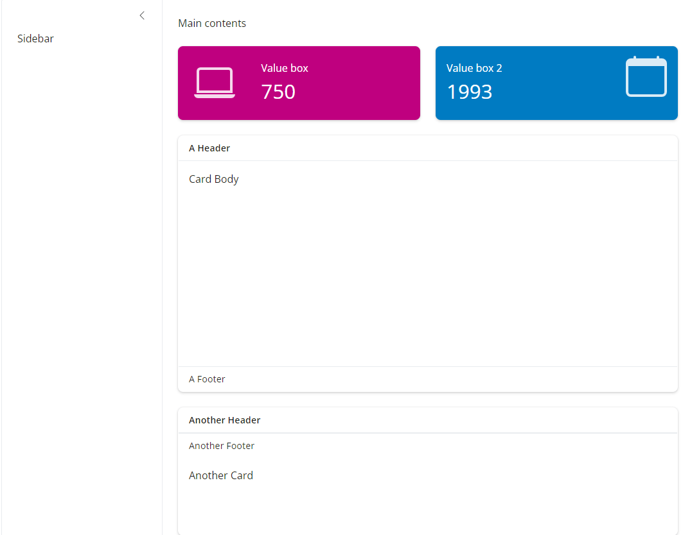

`layout_columns()` automatically places the two value boxes next to each other. By default, each element inside `layout_columns()` takes up equal space. If you want more control, you can specify `col_widths` for each element /12 e.g. ``` col_widths``= c(6, 6) ```.

### Exercise 3

3.  Use `layout_columns()` to set the `card()` elements into two columns. What do you notice about the height of the cards?

::: {.callout-tip collapse="true" title="Show Solution"}
```{r eval = FALSE}
# Cards in a single row
    layout_columns(
      card(
        height=400, 
        full_screen = TRUE, 
        card_header("A Header"), 
        card_body("Card Body"), 
        card_footer("A Footer")
        ), 
      
      card(
        height = 200, 
        full_screen = TRUE,
        card_header("Another Header"), 
        card_body("Another Card"), 
        card_footer("Another Footer")
        )
      ),

```

The two cards are now the same height as the tallest card. This is because `layout_columns()` automatically sets the height of each column to match the tallest element in that row.

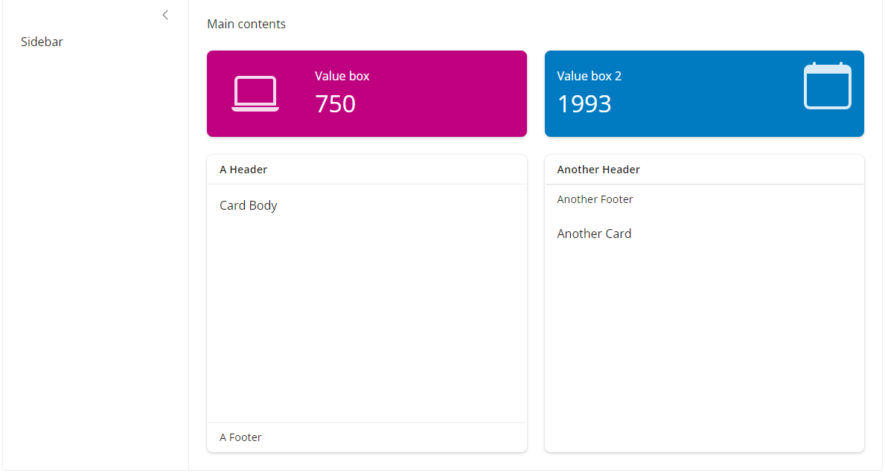
:::

### `layout_column_wrap()`

If you have many elements and want them to automatically wrap onto multiple rows (like a responsive grid), you can use `layout_column_wrap()`.

For example, you might want to display six value boxes, but have them wrap automatically depending on screen size:

```{r eval = FALSE}
# Value Boxes in a single row that wraps responsive to screen size
    layout_column_wrap( 
      value_box(
        title = "Value box", # Title
        value = 750,         # Value to show
        showcase = bsicons::bs_icon("laptop"), #include an icon
        theme = "pink" # change the box theme colour
        ), 
      
      value_box(
        title = "Value box 2", 
        value = 1993, 
        showcase = bsicons::bs_icon("calendar"), 
        showcase_layout = "top right", 
        theme = "blue" 
        ), 
      
      # addiditional boxes
      value_box(title = "Value box 3", value = 123), 
      value_box(title = "Value box 4", value = 456), 
      value_box(title = "Value box 5", value = 789), 
      value_box(title = "Value box 6", value = 101112)
    ), 

```

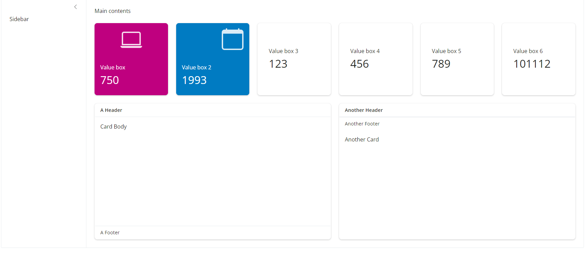{fig-align="left"}

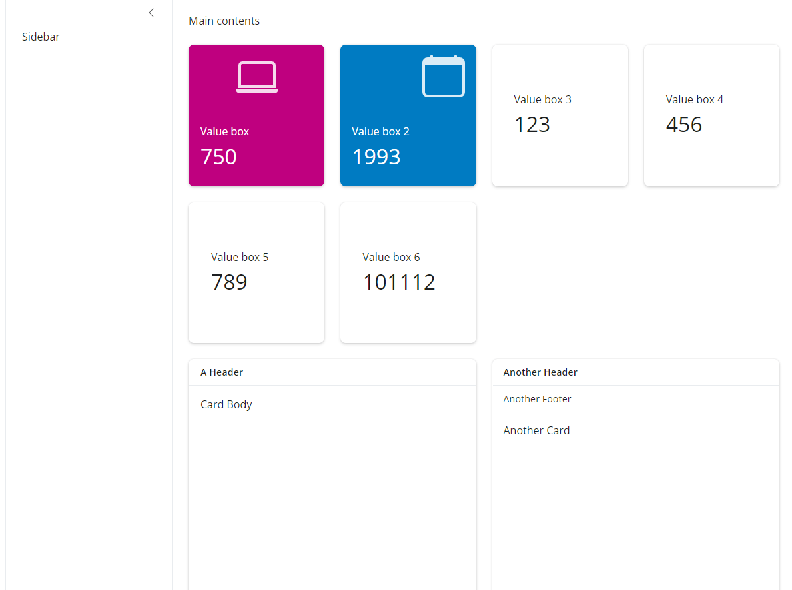{fig-align="right"}

This makes your app much more responsive: as users resize their browser window, the layout adjusts automatically.

## Widget Control Elements

Now that we’ve set up a clean layout using `bslib`, let’s add some interactive functionality, the sidebar is where we direct the user to select inputs the will send messages to the Shiny app. Shiny widgets collect a value from your user. When a user changes the widget, the value will change as well.

### Choosing the Right Input controls: A Quick Exploration

Before we add our first user input, it’s helpful to understand a few common types of **control widgets** in Shiny and when to use them. Inputs allow users to interact with the webpage by clicking a button, entering text, selecting an option, and more.

Shiny provides [several ways](https://shiny.posit.co/r/components/) for users to make selections here are a couple of options:\

| Input Type | Function | When to Use |
|------------------------|------------------------|------------------------|
| [Dropdown menu](https://shiny.posit.co/r/components/inputs/select-single/) | `selectInput()` | Best for **long lists** - compact and searchable |
| [Radio buttons](https://shiny.posit.co/r/components/inputs/radio-buttons/) | `radioButtons()` | Best for **short lists** with a few clear options (e.g., Yes/No, 3-4 choices) |
| [Checkbox group](https://shiny.posit.co/r/components/inputs/checkbox/) | `checkboxGroupInput()` | Best for selecting **multiple options** |
| [Autocomplete select](https://shiny.posit.co/r/components/inputs/selectize-single/) | `selectizeInput()` | Similar to `selectInput()`, but includes **type-ahead search** by default |
| [Single checkbox](https://shiny.posit.co/r/components/inputs/checkbox/) | `checkboxInput()` | Best for simple **on/off**, **true/false** inputs |
| [Slider](https://shiny.posit.co/r/components/inputs/slider/) | `sliderInput()` | Best for selecting **continuous values** or **ranges** |
| [Numeric input](https://shiny.posit.co/r/components/inputs/numeric-input/) | `numericInput()` | Best for **precise numeric entry** |
| [Text input](https://shiny.posit.co/r/components/inputs/text-area/) | `textAreaInput()` | Best for **free text entry** (e.g. names, IDs, labels) |
| [Date input](https://shiny.posit.co/r/components/inputs/date-selector/) | `dateInput()` | Best for selecting a **single date** |
| [Date range input](https://shiny.posit.co/r/components/inputs/date-range-selector/) | `dateRangeInput()` | Best for selecting a **start and end date** |
| [File upload](https://shiny.posit.co/r/components/inputs/file-input/) | `fileInput()` | Best for allowing users to **upload files** |
| [Action button](https://shiny.posit.co/r/components/inputs/action-button/) | `actionButton()` | Best for triggering **explicit actions** (e.g. submit, run model) |

Each widget function requires several arguments. The first two arguments for each widget are

-   a **name for the widget**: The user will not see this name, but you can use it to access the widget’s value. The name should be a character string.

-   a **label**: This label will appear with the widget in your app. It should be a character string, but it can be an empty string `""`.

In this example, the `name` is *“action”* and the `label` is *“Action”*: `actionButton("action", label = "Action")`

The remaining arguments vary from widget to widget, depending on what the widget needs to do its job. They include things like initial values, ranges, and increments. You can find the exact arguments needed by a widget on the widget function’s help page, (e.g., `?selectInput`).

### Exercise 4

4.  We might want our dashboard to be able to filter down and display data for a single Province in the dataset - lets test out some of these widget control examples above and select the most appropriate option for this.

Add the following code to the top of your script after your `library()` calls and before your `ui()` code. This ensures the data on Provinces is avaliable to the application.

```{r eval = FALSE}
list_of_provinces <- c("Central", "Copperbelt", "Eastern", "Luapula", "Lusaka", "Southern", "Muchinga", "Northern", "Northwestern", "Western")
```

Now replace your `sidebar` code with the following:

```{r eval = FALSE}
  layout_sidebar(
    sidebar = list(
      p("Test different input styles. Which one works best for selecting a province from a long list?"),
      
      selectInput(
        inputId = "dropdown_test", # ID name that can pass to the server as input$dropdown_test for processing
        label = "Dropdown input (selectInput):", # Title the user sees on the UI
        choices = sort(list_of_provinces) # values to show in the list drawn from all the province names 
      ),
      
      radioButtons(
        inputId = "radio_test",
        label = "Radio buttons (radioButtons):",
        choices = sort(list_of_provinces)
      ),
      
      checkboxGroupInput(
        inputId = "checkbox_test",
        label = "Checkbox group (checkboxGroupInput):",
        choices = sort(list_of_provinces)
      )
    ), 
```

> Reflect:
>
> -   What happens when the list is long?
>
> -   Which is more space-efficient?
>
> -   What would help users most?

::: {.callout-tip collapse="true" title="Show Solution"}
The best approach to use was `selectInput()` because:

-   We have many provinces to choose from

-   We only need one selection at a time

-   It’s clean, compact, and familiar to users
:::

## Pause & Reflect: Where We Are

Before we move forward, take a quick moment to review what you’ve built so far:

✅ You’ve created your own Shiny app from scratch.

✅ You set up a modern dashboard layout using `bslib::page_fluid()` and `layout_sidebar()`

✅ You’ve learned how to organize content using:

-   `card()` to hold your future plots and tables

-   `value_box()` to display key summary indicators

-   `layout_columns()` and `layout_column_wrap()` to control the page structure

✅ You’ve explored how to place **interactive control widgets** into the sidebar, which will allow users to control the application.

### Quick self-check questions

-   Do you understand the difference between **UI** and **Server** parts of the app?

-   Can you identify where the user interacts (inputs) vs where outputs will be displayed?

-   Do you feel comfortable adding more cards, value boxes, or inputs to your app?

# Part 2 Rendering output and Reactivity

In Part 2, you will learn:

-   How to add display elements into the dashbaord cards.

-   How to connect your dataset to generate outputs.

-   How to update your value boxes and outputs automatically when the user interacts with selection widgets.

In Shiny, **reactive expressions** automatically update when the user interacts with your app.

## Shiny Output Types

You can create outputs in Shiny with a two step process.

1.  Add an object to your user interface.

2.  Tell Shiny how to build the object in the server function. The object will be reactive if the code that builds it calls a widget value.

Shiny provides a [family of functions](https://shiny.posit.co/r/components/) that turn R objects into a Shiny output. Each function creates a specific type of output.

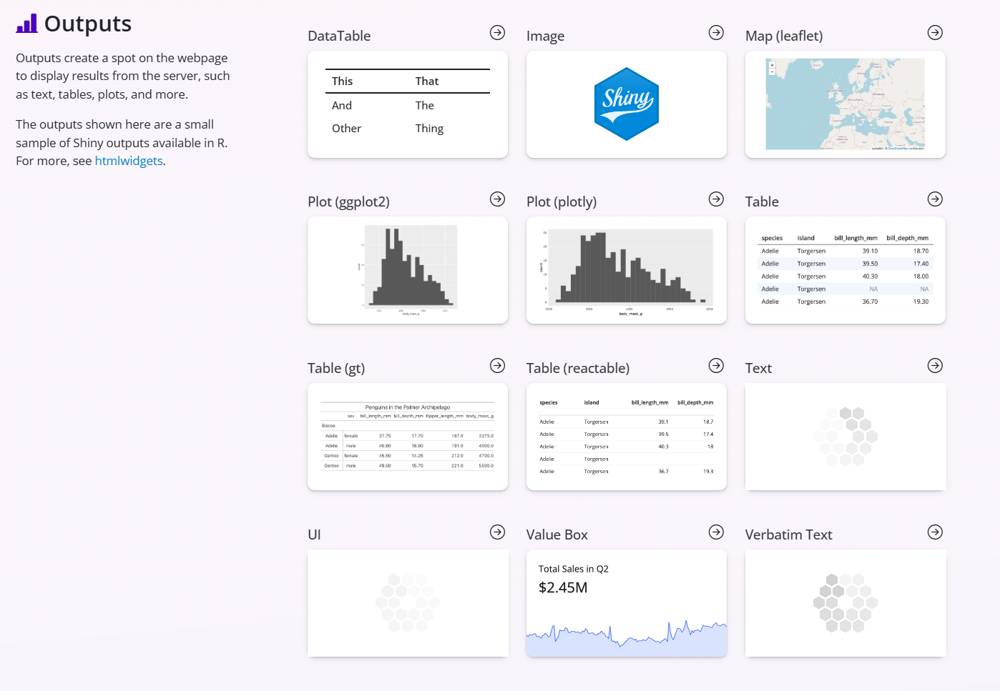

Below is a summary of some key output types, the functions to tell shiny what the expect in the UI and the functions to create it in the server and a short desciption of when to use.

| Output Type | Render Function (Server) | Display Function (UI) | When to Use |
|------------------|------------------|------------------|------------------|
| **Text** | `renderText()` | `textOutput()` | Display simple text strings |
| **Tables (static)** | `renderTable()` | `tableOutput()` | Show small static tables |
| **Tables (interactive)** | `renderDT()` | `DT::dataTableOutput()` | Show sortable, searchable tables |
| **Plots (static)** | `renderPlot()` | `plotOutput()` | Standard static plots (ggplot, base R plots) |
| **Plots (interactive)** | `renderPlotly()` | `plotlyOutput()` | Fully interactive plots (hover, zoom, pan) |
| **Leaflet Maps** | `renderLeaflet()` | `leafletOutput()` | Interactive geographic maps |
| **Images** | `renderImage()` | `imageOutput()` | Display image files (PNG, JPG, etc.) |
| **UI elements** (dynamic) | `renderUI()` | `uiOutput()` | Dynamically generate any custom UI |
| **Value Boxes** | *(no render function)* | `value_box()` | Display single KPI summary values |

> What you will notice is that Every output type has:
>
> -   **One render function** → goes in the server
>
> -   **One output function** → goes in the UI

And you connect them using a shared `outputId`

## Building Outputs: `ui` and `server` crosstalk

Lets work through an example to display some information in a `card()` in the main body of our application. Currently we have just manually specified text and values but lets pull this information from our dataset now. We want to add text output on the *earliest* and *most recent* date in our DHIS2 data extract

e.g. we want to show some text that says: \> *"Data is avaliable from: \[date\] to \[date\]"*

## Ensuring the App has access to our datasets

Our first step is to ensure that the application has access to our data!

We need to ensure that we have at the very top of our script, after the `library()` call and prior to the `ui()` and `sever()` code, code to read in our datasets (DHIS2 data, shapefiles), ensuring the data formats are correct!

```{r eval=FALSE}
#-Read in data for the application-----------------
# Ensure the correct file paths for your project
dhis2_data <- 
  readRDS("data-clean/dhis2-dashboard-clean.RDS") 

province_shp <- readRDS("data-clean/province-shp-clean.RDS") #shapefiles
district_shp <- readRDS("data-clean/district-shp-clean.RDS") #shapefiles
pop_data     <- readRDS("data-clean/pop-data.RDS") #population data

```

We have the following variables in this dataset:

-   `province`
-   `district`
-   `period`
-   `year`
-   `data_type`: `Confirmed`, `Clinical`, `Tested`
-   `count`

## `ui()` side arguments

Next we need to update one of our `card()` functions to tell the `card_body()` to display the values from our dataset. As we are displaying plain text we use a `textOutput()` function call to tell the `ui` this will be a text output.

```{r eval= FALSE}
# Cards in a single row
    layout_columns(
      card(
        height = 400,
        full_screen = TRUE,
        card_header("A Header"),
        card_body(textOutput("date_text_test")), # add textOutput to display text 
        card_footer("A Footer")
      ),
      card(
        height = 200,
        full_screen = TRUE,
        card_header("Another Header"),
        card_body("Another Card"),
        card_footer("Another Footer")
      )
    )
```

::: callout-note
Notice that `textOutput()` takes an argument, the character string `"date_text_test"`. Each of the `*Output` functions require a single argument: a character string that Shiny will use as the name of your reactive element. Your users will not see this name, but you will use it later.
:::

Placing this function in `ui` tells Shiny where to display your object. Next, you need to tell Shiny how to build the object.

We do this by providing the R code that builds the object in the `server` function.

## `server()` side arguments

The `server` function plays a special role in the Shiny process; it builds a list-like object named `output` that contains all of the code needed to update the R objects in your app. Each R object needs to have its own entry in the list.

You can create an entry by defining a new element for `output` within the `server` function, like below. The element name should match the name of the reactive element that you created in the `ui`.

In the `server` function below, `output$date_text_test` matches `textOutput("date_text_test")` in your `ui`.

```{r eval= FALSE}
server <- function(input, output) {
  
  # tell the server to render Text as this output object
  output$date_text_test <- renderText({
  
    # Standard R code to identify min and max information and paste text 
    paste0("Data is avaliable from: ", min(dhis2_data$period), " to ", max(dhis2_data$period))
    
  })
  
}

```

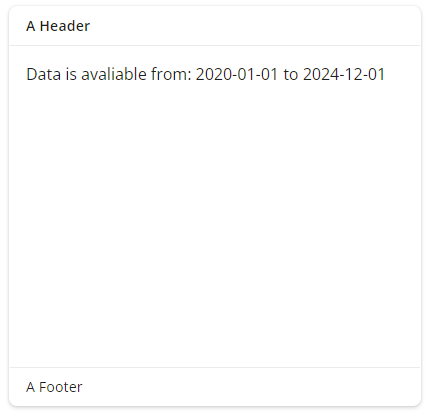

### Exercise 5

5a. What happens if we replace the `textOutput` function in the ui with a `plotOutput`?

::: {.callout-tip collapse="true" title="Show Solution"}
No output is produced as we have a mismatch between the `plotOutput` in the ui and `renderText` in the server.

We need to make sure that we are matching the correct `ui` and `server` side logic.
:::

5b. Lets try now adding a plot to the second card. Create a standard `ggplot()` output. Create a bar plot that plots `period` on the x-axis, `count` on the y-axis and fills by `data_type`. *Hint* - this plot won't look very nice but we are just ensuring we can add a plot element. Ensure you update both the `ui()` and `server()` side information.

::: {.callout-tip collapse="true" title="Show Solution"}
```{r eval = FALSE}

# UI side
    # Cards in a single row
    layout_columns(
      card(
        height = 400,
        full_screen = TRUE,
        card_header("A Header"),
        card_body(textOutput("date_text_test")),
        card_footer("A Footer")
      ),
      card(
        height = 200,
        full_screen = TRUE,
        card_header("Another Header"),
        card_body(plotOutput("plot_test")),
        card_footer("Another Footer")
      )
    )

# Servere Side
server <- function(input, output) {
 
   # Text output 
  output$date_text_test <- renderText({
    # Standard R code to identify min and max information and paste text
    paste0("Data is avaliable from: ", min(dhis2_data$period), " to ", max(dhis2_data$period))
  })

  # Plot output
  output$plot_test <- renderPlot({
    # standard r code for a simple ggplot output
    ggplot(dhis2_data) +
      geom_col(aes(x = period, y = count, fill = data_type))
  })
}


```


:::

## Bonus: Plot interactivity

In this example we implemented a simple static `ggplot()` but as we have a dashboard we can enhance our plots to be *interactive* this means the user can hover over data points and see information, zoom in and out, remove series etc.

To do this we use a `plotlyOutput` instead.

::: callout-note
📊 [Plotly](https://plotly.com/r/) **for Interactive Plots**

The [Plotly](https://plotly.com/r/) package allows you to turn static `ggplot2` charts into interactive visualizations. This means users can **hover over points**, **zoom in**, **pan across the plot**, and **see tooltips** with data values.

In Shiny, this is especially useful for dashboards where you want dynamic, user-driven exploration of your data.

We use the `ggplotly()` function to **convert a regular `ggplot` object into a Plotly object**, making it fully interactive with minimal changes to your code.

Just remember that not all `ggplot2` features translate perfectly, some customization may require testing or tweaking. Or you can always build plots directly using `Plotly` code but for now we’ll stick with ggplot \> ploty conversion.
:::

```{r eval = FALSE}
card(height = 400,
     full_screen = TRUE,
     card_header("Another Header"),
     card_body(plotlyOutput("plot_test")), # specify Plotly Output
     card_footer("Another Footer")
     )

```

```{r eval = FALSE}
 #-Plot output------------------------------
  output$plot_test <- renderPlotly({
    p <-
      ggplot(dhis2_data) +
      geom_col(aes(x = period, y = count, fill = data_type))

    # Convert ggplot to interactive Plotly object
    ggplotly(p)
  })

```

✅**Check**: Try interacting with the plot in your dashboard - select a data series in the legend - what happens when you click?

## Incorporating reactivity

`input` is a second list-like object created by the server function. It stores the current values of all of the widgets in your app. These values will be saved under the names that you gave the widgets in your `ui`.

Shiny will automatically make an object reactive if the `object` uses an `input` value. For example, the `server` function.

Lets demonstrate this by building in a selection widget to select the year for which we want to visualize data for in our dashboard.

We’ll use a dropdown menu (`selectInput()`) so users can choose between viewing data from specific years.

Add this to your `sidebar` inside the `ui`:

```{r eval = FALSE}
#-sidebar---------
    sidebar = list(
      p("Add a selection widget"),
      selectInput(
        inputId = "dropdown_year",  # ID name to use in the server
        label = "Select a year:",   # What the user will see
        choices = c(unique(dhis2_data$year)),  # Choices shown in the list
        selected = max(dhis2_data$year)        # Default selection - we default to the most recent year in the dataset
      )
    ),
```

::: column-margin
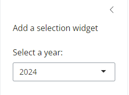
:::

**Note**: `inputId` is important! It tells Shiny how to reference this widget later as `input$dropdown_year`.

Now we’ll tell Shiny how to update the data based on what the user selects.

Inside your server function, before defining your outputs, add:

```{r eval = FALSE}

 # Reactive dataset that depends on the dropdown
  filtered_data <- reactive({

      dplyr::filter(dhis2_data, year == input$dropdown_year)

  })

```

What this is doing is creating a `reactive` dataset - so that now, when the user selects a new year (e.g. 2021), the dataset is filtered to just that year.

**Shiny automatically re-runs this code whenever the drop down value changes.**

Now we’ll update the text card to display different text depending on the year selected.

Replace your old `renderText()` with this:

```{r eval = FALSE}
output$date_text_test <- renderText({
  
  # first tell the code that we are using the reactive dataset now
  df <- filtered_data() 
  
  # use the reactive data 
  paste0("Data is available from: ", min(df$period)," to ",  max(df$period))
  
})
```

✅ Check: Try selecting different years in the dropdown - your text should automatically update!

Now we’ll make the plot update to match the selected year too:.

```{r eval = FALSE}

  #-Plot output------------------------------
  output$plot_test <- renderPlotly({
    # filtered data
    df <- filtered_data()

    # plot
    p <-
      ggplot(df) +
      geom_col(aes(x = period, y = count, fill = data_type))

    # Convert ggplot to interactive Plotly object
    ggplotly(p)
  })

```

✅ Check: Your plot should automatically change when you select a different year!

## What we learned

-   Each entry to `output$ <-` should contain the output of one of Shiny’s `render*` functions. These functions capture an R expression. Use the `render*` function that corresponds to the type of reactive object you are making.

-   Each `render*` function takes a single argument: an R expression surrounded by braces, `{}`. The expression can be one simple line of text, or it can involve many lines of code, as if it were a complicated function call.

-   Think of this R expression as a set of instructions that you give Shiny to store for later. Shiny will run the instructions when you first launch your app, and then Shiny will re-run the instructions every time it needs to update your object.

-   For this to work, your expression should return the object you have in mind (a piece of text, a plot, a data frame, etc.). You will get an error if the expression returns the wrong type of object.

### Exercise 6

6.  Lets try and update the values boxes we have currently in the Shiny app too with some information from our reactive data. Lets sum the *Total confirmed malaria cases* and *Total malaria tests* to be shown as the `value =` in our `value_box()`.

I've outlined the steps below try and add the code to complete each step before checking the answer:

**Step 1**: Create a new `output$` element that will hold the value of the sum of total confirmed malaria cases. Ensure we sum over confirmed cases `data_type` in our dataset and as this is likely to be a large number ensure we have comma separators when we format the value.

::: {.callout-tip collapse="true" title="Show Solution"}
Place in the `server` code:

```{r eval = FALSE}
# Text output for value box confirmed cases  
output$value_conf <- renderText({
   
   df <- filtered_data() 

    total_cases <-
      df %>%
      # filters to confirmed malaria cases
      filter(data_type %in% c("Confirmed")) %>%
      # sums over all locations and year(s) selected by the user
      summarise(total = sum(count, na.rm = TRUE)) %>%
      # pulls out the value from summary calculation into named vector
      pull(total)

    # Format with commas for readability
    formatted_total <- scales::comma(total_cases)
    
    paste0(formatted_total)
  })

```
:::

**Step 2:** Update the `value_box()` function call by removing the currently hard coded `value = 750`, with the with the dynamic text from our server `"value_conf"` - select the correct `*Output` function to do so. Provide an appropriate `Title` and update the `bs_icon` to match our type of data.

::: {.callout-tip collapse="true" title="Show Solution"}
```{r eval = FALSE}
# Total confirmed cases reported  
 value_box(
        title = "Total Confirmed Cases Reported",
        value =  textOutput("value_conf"), # reactive value taken from server side outputs
        showcase = bsicons::bs_icon("journal-medical"),
        showcase_layout = "top right", 
        theme = "pink"
      )

```
:::

Now **repeat for tests** conducted.

::: {.callout-tip collapse="true" title="Show Solution"}
```{r eval = FALSE}
 # Text output for value box tests
  output$value_test <- renderText({
    df <- filtered_data() # this act like a function and pulls through our filtered data to an object inside renderText called 'df'
    
    total_tests <-
      df %>%
      # filters to tests
      filter(data_type %in% c("Tested")) %>%
      # sums over all locations and year(s) selected by the user
      summarise(total = sum(count, na.rm = TRUE)) %>%
      # pulls out the value from summary calculation into named vector
      pull(total)
    
    # Format with commas for readability
    formatted_total <- scales::comma(total_tests)
    
    paste0(formatted_total)
  })
```

```{r eval = FALSE}
value_box(
        title = "Total Tests Reported",
        value = textOutput("value_test"),
        showcase = bsicons::bs_icon("journal-medical"),
        showcase_layout = "top right",
        theme = "blue"
      )
```
:::

Which should give us something that looks like this:

::: {.callout-tip collapse="true" title="Show Solution"}
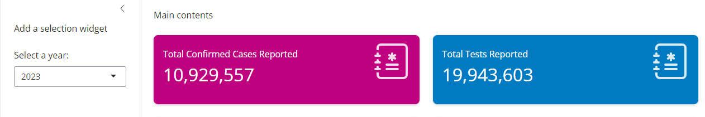
:::

### Exercise 7

7.  You may have noticed we also have data for clinically diagnosed malaria, lets add 2 more value boxes to our dashboard - one for *clinical malaria* total for the year and one for total *all malaria diagnosis*.

::: {.callout-tip collapse="true" title="Show Solution"}
```{r eval = FALSE}
#-Define UI for application - User Interface------------------------------------
ui <- page_fluid(

  #-layout------------------------
  layout_sidebar(

    #-sidebar---------
    sidebar = list(
      p("Add a selection widget"),
      selectInput(
        inputId = "dropdown_year", # ID name to use in the server
        label = "Select a year:", # What the user will see
        choices = c(unique(dhis2_data$year)), # Choices shown in the list
        selected = max(dhis2_data$year) # Default selection - we default to the most recent year in the dataset
      )
    ),

    #-main pannel content----
    "Main contents",

    # Value Box
    layout_column_wrap(
      # Total confirmed cases reported
      value_box(
        title = "Total Confirmed Cases Reported",
        value = textOutput("value_conf"), # reactive value taken from server side outputs
        showcase = bsicons::bs_icon("journal-medical"),
        showcase_layout = "top right",
        theme = "pink"
      ),
      value_box(
        title = "Total Tests Reported",
        value = textOutput("value_test"), # reactive value taken from server side outputs
        showcase = bsicons::bs_icon("journal-medical"),
        showcase_layout = "top right",
        theme = "blue"
      ),
      value_box(
        title = "Total Clinically Diagnosed Cases Reported",
        value = textOutput("value_clin"), # reactive value taken from server side outputs
        showcase = bsicons::bs_icon("thermometer-high"),
        showcase_layout = "top right",
        theme = "orange"
      ),
      value_box(
        title = "Total Cases Reported",
        value = textOutput("value_total_cases"), # reactive value taken from server side outputs
        showcase = bsicons::bs_icon("calculator"),
        showcase_layout = "top right",
        theme = "yellow"
      )
    ),

    # Card
    layout_columns(
      card(
        height = 400,
        full_screen = TRUE,
        card_header("A Header"),
        card_body(textOutput("date_text_test")),
        card_footer("A Footer")
      ),
      card(
        height = 400,
        full_screen = TRUE,
        card_header("Another Header"),
        card_body(plotlyOutput("plot_test")), # specify Plotly Output
        card_footer("Another Footer")
      )
    )
  )
)


#-Define server logic - Computations--------------------------------------------
server <- function(input, output) {
  #-Reactive dataset that depends on the dropdown------
  filtered_data <- reactive({
   
      dplyr::filter(dhis2_data, year == input$dropdown_year)
  
  })


  #-Text output----------------------------------------
  output$date_text_test <- renderText({
    # first tell the code that we are using the reactive dataset now
    df <- filtered_data()

    # use the reactive data
    paste0("Data is available from: ", min(df$period), " to ", max(df$period))
  })

  #-Plot output----------------------------------------
  output$plot_test <- renderPlotly({
    # filtered data
    df <- filtered_data()

    # plot
    p <-
      ggplot(df) +
      geom_col(aes(x = period, y = count, fill = data_type))

    # Convert ggplot to interactive Plotly object
    ggplotly(p)
  })

  #-Text output for value box confirmed cases----------
  output$value_conf <- renderText({
    df <- filtered_data()

    total_cases <-
      df %>%
      # filters to confirmed malaria cases
      filter(data_type %in% c("Confirmed")) %>%
      # sums over all locations and year(s) selected by the user
      summarise(total = sum(count, na.rm = TRUE)) %>%
      # pulls out the value from summary calculation into named vector
      pull(total)

    # Format with commas for readability
    formatted_total <- scales::comma(total_cases)

    paste0(formatted_total)
  })

  #-Text output for value box tests------------------
  output$value_test <- renderText({
    df <- filtered_data()

    total_tests <-
      df %>%
      # filters to tests
      filter(data_type %in% c("Tested")) %>%
      # sums over all locations and year(s) selected by the user
      summarise(total = sum(count, na.rm = TRUE)) %>%
      # pulls out the value from summary calculation into named vector
      pull(total)

    # Format with commas for readability
    formatted_total <- scales::comma(total_tests)

    paste0(formatted_total)
  })

  #-Text output for value box clinical------------------
  output$value_clin <- renderText({
    df <- filtered_data()

    total <-
      df %>%
      # filters to clinical
      filter(data_type %in% c("Clinical")) %>%
      # sums over all locations and year(s) selected by the user
      summarise(total = sum(count, na.rm = TRUE)) %>%
      # pulls out the value from summary calculation into named vector
      pull(total)

    # Format with commas for readability
    formatted_total <- scales::comma(total)

    paste0(formatted_total)
  })

  #-Text output for value box clinical------------------
  output$value_total_cases <- renderText({
    df <- filtered_data()

    total <-
      df %>%
      # filters to clinical
      filter(data_type %in% c("Clinical", "Confirmed")) %>%
      # sums over all locations and year(s) selected by the user
      summarise(total = sum(count, na.rm = TRUE)) %>%
      # pulls out the value from summary calculation into named vector
      pull(total)

    # Format with commas for readability
    formatted_total <- scales::comma(total)

    paste0(formatted_total)
  })
}

```

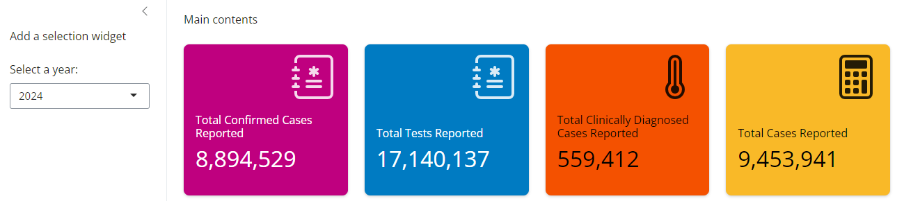
:::

# Pause and Reflect

✅ You now have a fully reactive dashboard skeleton:

-   Inputs: User selects a Year.

-   Reactive filtering: The app filters the dataset automatically.

Outputs:

-   Value boxes update in real-time

-   Interactive time series plots update dynamically

-   You’ve seen how both text-based and graphical outputs follow the same reactivity pattern.

::: {.callout-caution title="What do you think?"}
What do you think about this dashboard so far? Is it actually useful for an end-user or have we just learnt some key skills?
:::

# Part 3: Evolving Features - Making Our App Better!

Now that we’ve learnt some of the basic functionality of our dashboard, let’s improve the **user experience**, visual polish and ensure that all cards and value boxes contain useful information to the end-user.

Firstly here are small enhancements that go a long way in making your app more intuitive, accessible, and navigable for the user.

## Adding a Short Description of the Application

As we continue to improve the user experience, it’s helpful to provide some **context or instructions** directly in the app. One simple but effective enhancement is adding a short **descriptive text** at the top of the sidebar panel and an application title.

This gives users a quick overview of what the tool does, what the inputs mean, or what they should expect to see - without needing to refer to an external guide.

In our `ui` we can replace the `p("Add a selection widget")` with a more informative description. And add a main title to replace `"Main contents"` .

Currently we have just used plan text but we can format our text into Headings Styles to make titles stand out to the user, you can use the functions `h1()` for Heading 1 style, `h2()`, `h3()` etc.

The `p()` function inserts a paragraph of plain text.

```{r eval = FALSE}
#-Define UI for application - User Interface------------------------------------
ui <- page_fluid(

  #-layout------------------------
  layout_sidebar(

    #-sidebar---------
    sidebar = list(
      p("DHIS2 data has been cleaned and summarised from the facility level data."), # sidebar title
      selectInput(
        inputId = "dropdown_year", # ID name to use in the server
        label = "Select a year:", # What the user will see
        choices = c(unique(dhis2_data$year)), # Choices shown in the list
        selected = max(dhis2_data$year) # Default selection - we default to the most recent year in the dataset
      )
    ),

    #-main pannel content----
    h1("Zambia Malaria Indicators Dashboard"), # App title

```

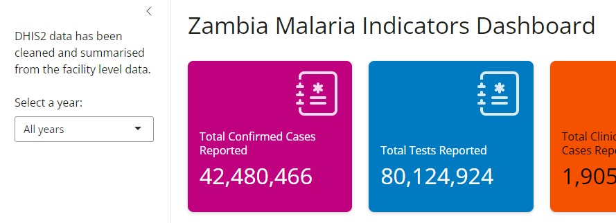

::: callout-tip
If you want to include more detailed information (e.g., methodology or indicator definitions), we could use a [collapsible help text](https://rstudio.github.io/bslib/reference/accordion.html), a [modal popup](https://shiny.posit.co/r/reference/shiny/1.6.0/modaldialog.html), or a [separate “About” tab](https://shiny.posit.co/r/layouts/tabs/).

For now lets keep things simple.
:::

## Theming with `bs_theme` 🎨

Until now, our dashboard has been using the **default Shiny style:** functional,but plain and we added colour values to our `value_box`. We can now take advantage of the [`bslib`](https://rstudio.github.io/bslib/) package to apply **modern, responsive theming** with just a few lines of code (via [bootswatch](https://bootswatch.com/default/)).

Applying a theme makes your app easier to use, improves readability, and gives it a more professional look - especially useful when sharing with stakeholders or integrating into your organization’s brand.

We can tell our app directly to use a built-in theme in the `UI` code, add the following code to the top of your `ui()` function, before the `layout_sidebar()` call.

```{r eval = FALSE}

# Adding theming elements
theme = bs_theme(
    version = 5,                       # Use Bootstrap 5
    bootswatch = "darkly",             # Choose a Bootswatch theme
    base_font = font_google("Roboto")  # Optional: use a modern font
  )

```

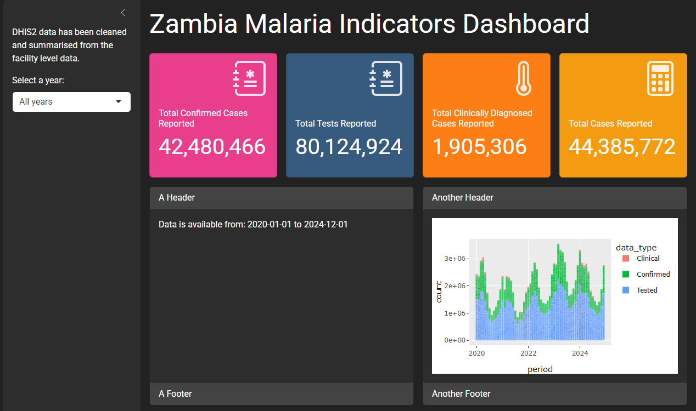

### Exercise 8

8.  Try replacing `"darkly"` with other [Bootswatch themes](https://bootswatch.com/) like `"cosmo"`, `"journal"`, `"sandstone"`, `"minty"`, or `"cybord"` or select from the webpage linked. **Hint** If your Shiny theme doesn't change when you run the App - try restarting your R session. If we remove the hard coded `theme=` values of our `value_boxes()` they too will update with the chosen `bs_theme`.

You can also try out styles **live inside your app** using `bs_themer()`. To use it, just call `bs_themer()` once inside your `server()` function:

```{r eval = FALSE}
server <- function(input, output) {
  
  bs_themer()
  
  # The rest of our code ... 
  
} 
```

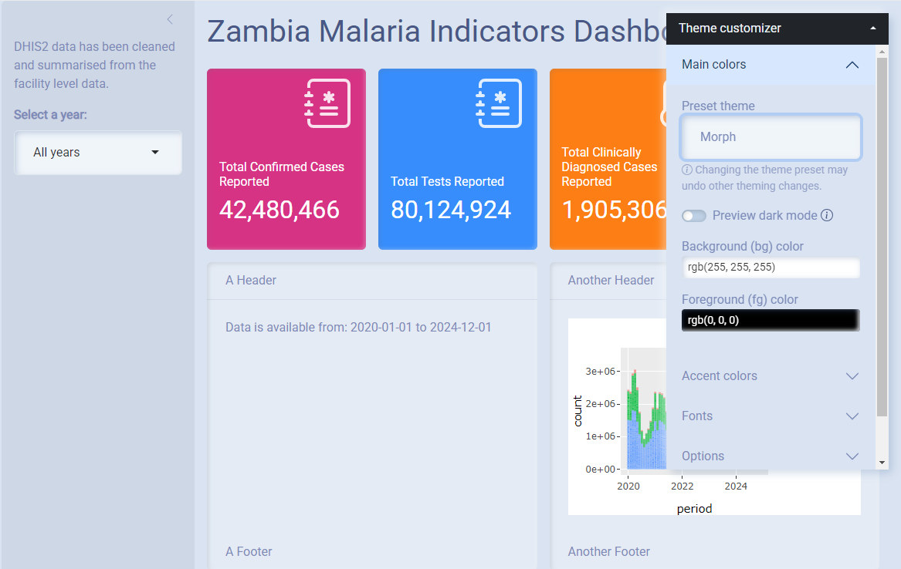

### 🎨🖌 Lets get creative!

As well as experimenting with pre-built themes you can also customise your own theming using `bs_themer` - play around with colours, fonts etc and create your own theme for your application. You may want to pick colors that resonate with the country or program branding, PATH colours or your favorite football team - get creative!

`bs_themer` lets us know what we changed and then we can add this to our `theme = bs_theme()` call.

For example here's a custom theme I selected using `bs_themer()` and how I translated the elements into `bs_theme()`

```{r eval = FALSE}
  # Adding theming elements
  theme = bs_theme(
    version = 5, 
    fg = "rgb(249, 95, 139, 0.71)",   # set the foreground colour
    bg = "rgb(255, 255, 255)", # set the background colour 
    primary = "#6D475F",       # set the primary colour 
    secondary = "#C3A3EF",      # set the secondary colour
    success = "#A8D578",       # set the success colour
    info = "#95AFF1",          # set the info colour
    warning = "#EB9158",       # set the warning colour
    danger = "#F16B6B",        # set the danger colour
  )

```

::: callout-caution
**Don’t forget** to remove `bs_themer()` from the `server()` once you're done - it's just for development.
:::

To give users the opportunity to pick between a light or dark mode of your dashboard too you can simply implement the following in the `ui`

Here we place it after the description in the sidebar but you can place it anywhere in the UI and set the default to start the app in light mode.

```{r eval = FALSE}
# add dark/light switch 
input_dark_mode(mode="light")
```

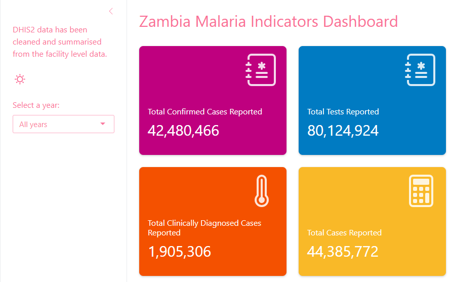

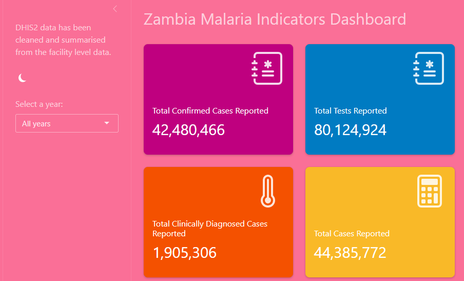

Now we have developed a theme we have another option for how to set the theme argument for our value boxes. To ensure that when we change the theme of our app our value boxes automatically align with that theme we can set the theme argument to be `"primary"` or `"secondary"` etc and the boxes will inherit the colour values of the themes defined colours - let's add this now.

```{r eval = FALSE}
# Value Boxes
    layout_column_wrap(
      # Total confirmed cases reported
      value_box(
        title = "Total Confirmed Cases Reported",
        value = textOutput("value_conf"), # reactive value taken from server side outputs
        showcase = bsicons::bs_icon("journal-medical"),
        showcase_layout = "top right",
        theme = "primary"
      ),
      value_box(
        title = "Total Tests Reported",
        value = textOutput("value_test"), # reactive value taken from server side outputs
        showcase = bsicons::bs_icon("journal-medical"),
        showcase_layout = "top right",
        theme = "secondary"
      ),
      value_box(
        title = "Total Clinically Diagnosed Cases Reported",
        value = textOutput("value_clin"), # reactive value taken from server side outputs
        showcase = bsicons::bs_icon("thermometer-high"),
        showcase_layout = "top right",
        theme = "success"
      ),
      value_box(
        title = "Total Cases Reported",
        value = textOutput("value_total_cases"), # reactive value taken from server side outputs
        showcase = bsicons::bs_icon("calculator"),
        showcase_layout = "top right",
        theme = "danger"
      )
    )

```

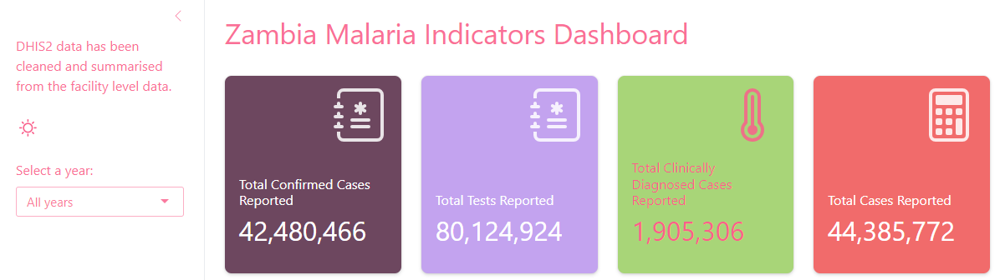

## Adding a Logo to Your App

Once you’ve customized the colors and fonts, finish off your look by **adding a logo** (or icon/banner) to the top of your `sidebar = sidebar()` code.

```{r eval = FALSE}
#-sidebar---------
    sidebar = list(
      # add a logo 
      tags$img(src = "logo.png"), # make sure this image exists in a folder called www 
      
      p("DHIS2 data has been cleaned and summarised from the facility level data."), 

      input_dark_mode(mode = "light"),
      selectInput(
        inputId = "dropdown_year", # ID name to use in the server
        label = "Select a year:", # What the user will see
        choices = c(unique(dhis2_data$year)), # Choices shown in the list
        selected = max(dhis2_data$year) # Default selection - we default to the most recent year in the dataset
      )
    )
```

Then do the following:

Folder Setup

-   Create a `www/` folder in your app directory if it doesn’t exist.

-   Save your logo or image as `logo.png` (or any name but it must match what you coded up).

-   Shiny will automatically read image files from that folder.

::: column.margin
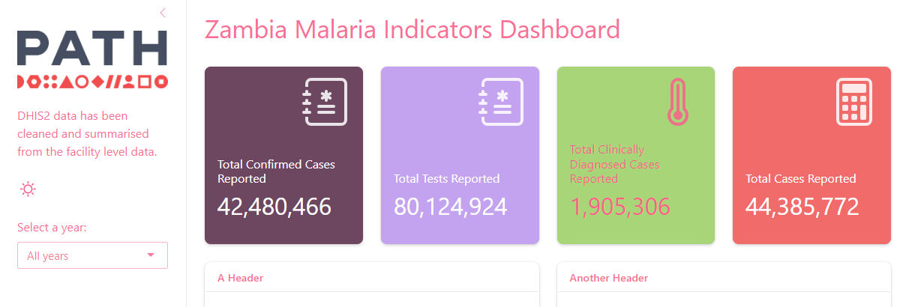
:::

### Exercise 9

9.  Find a logo online (e.g., your org, country flag, or malaria-related symbol or an image of your pet). Create and save it to your app’s `www/` folder. Add it to the sidebar using `tags$img()`.

## Wrapping up Part 3 - Evolved Styling

In Part 3, we made your app feel more professional and intuitive for end users:

-   Included **descriptive text** in your sidebar and main title.

-   Applied a **customizable visual theme** with `{bslib}`.

-   Enhanced **branding** by adding a logo.

-   Made sure your **value boxes inherit theme colors** automatically.

These are small details - but they make your app feel polished, intentional, and ready to share with end users.

::: {.callout-caution title="What do you think?"}
What do you think about this dashboard so far? Is it actually useful for an end-user or have we just learnt some key skills?
:::

# Part 4 - Building for the user

Now lets improve the overall user experience of our application. Right now we have a whole card displaying not alot of data along with a plot that displays too much information.

To streamline lets add the summary information on our data availability period to underneath the time period selection input - lets format the dates to make it easier for the user to read too.

In the server code update the `output$date_text_test` code:

```{r eval = FALSE}
  #-Text output----------------------------------------
  output$date_text_test <- renderText({
    # first tell the code that we are using the reactive dataset now
    df <- filtered_data()
    
    # find the earliest and latest dates
    min_date <- min(df$period)
    max_date <- max(df$period)
    
    # use the reactive data
    paste0("Data is shown from: ", format(min_date, "%B %d, %Y"), " to ", format(max_date, "%B %d, %Y"))
  })
```

Now in the `ui` code remove the first `card()` and update the `sidebar` code to place our summary text right after the input selection tool:

```{r eval = FALSE}
 #-sidebar---------
    sidebar = list(

      # add a logo
      tags$img(src = "logo.png"),

      #-Add light/dark option--------
      input_dark_mode(mode = "light"),

      # Input selection
      selectInput(
        inputId = "dropdown_year", # ID name to use in the server
        label = "Select a year:", # What the user will see
        choices = c(unique(dhis2_data$year)), # Choices shown in the list
        selected = max(dhis2_data$year) # Default selection - we default to the most recent year in the dataset
      ),
      # Test summarise the time period avaliable
      textOutput("date_text_test")
    ),
```

Now it's time to enhance what our user is actually able to see and interact with in our data, let’s level up by introducing **addiditional output types** and features so that we can convey more information than what we have currentlly presented in our app.

A reminder that Shiny supports a wide range of different output types


We'll walk through some different examples of outputs how we can control their appearance/dissapearance in the app.

## Plotting enhancements - tab set cards

Now lets work on our plot - lets make this card just display the `Confirmed` malaria case data.

```{r eval = FALSE}
#-Plot output----------------------------------------
  output$plot_test <- renderPlotly({
    # filtered data
    df <-
      filtered_data() |>
      # Confirmed cases only
      filter(data_type == "Confirmed")

    # plot
    p <-
      ggplot(df) +
      geom_col(aes(x = period, y = count, fill = data_type))

    # Convert ggplot to interactive Plotly object
    ggplotly(p)
  })

```

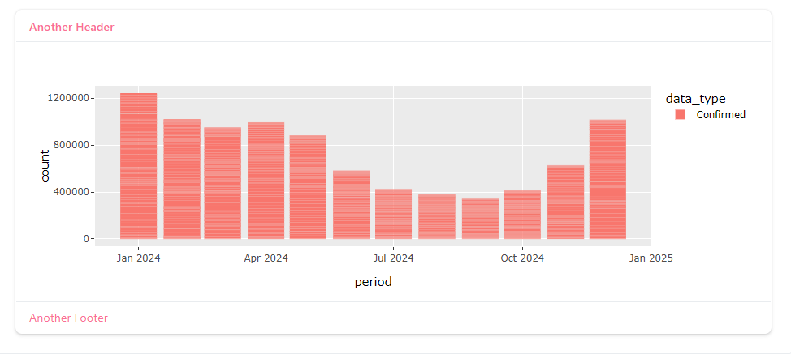

This still doesn't look great and you'll notice that we have many bars making up each month in our plot - this is because we haven't aggregated any data yet and all of the `district` level data is being displayed.

Lets summarise the data to the national level, to help us decide what plots are useful for this dashoard - we'll build in different level summaries later on but lets focus just on national level for this time.

```{r eval = FALSE}
#-Plot output----------------------------------------
  output$plot_test <- renderPlotly({
    # filtered data
    df <-
      filtered_data() |>
      # Confirmed cases only
      filter(data_type == "Confirmed") |>
      # group by period
      group_by(period, data_type) |>
      # summarise counts
      summarise(count = sum(count, na.rm = TRUE))

    # plot
    p <-
      ggplot(df) +
      geom_col(aes(x = period, y = count, fill = data_type))

    # Convert ggplot to interactive Plotly object
    ggplotly(p)
  })

```

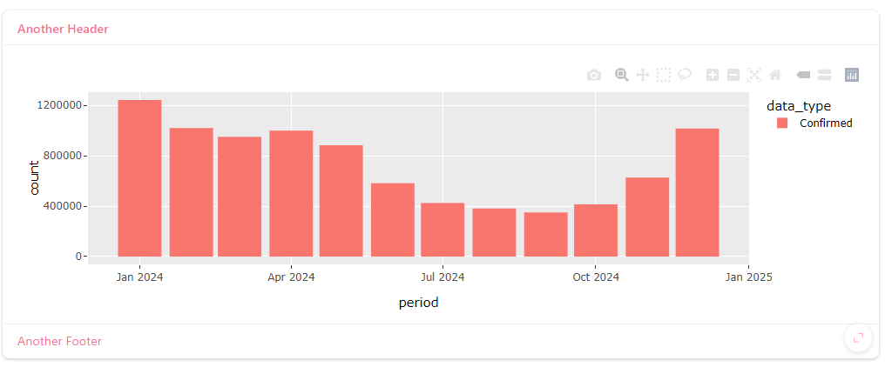

This still isn't the best appearance so lets change the following too: - `geom_point()` and `geom_line()` - cleaner themeing with `theme_minimal()` - better axis labels

```{r eval = FALSE}
  #-Plot output----------------------------------------
  output$plot_test <- renderPlotly({
    # filtered data
    df <-
      filtered_data() |>
      # Confirmed cases only
      filter(data_type == "Confirmed") |>
      # group by period
      group_by(period, data_type) |>
      # summarise counts
      summarise(count = sum(count, na.rm = TRUE))

    # plot
    p <-
      ggplot(
        df,
        aes(x = period, y = count, col = data_type)
      ) +
      geom_point() +
      geom_line() +
      labs(
        x = "Month, Year",
        y = "Count",
        col = "Data Element"
      ) +
      theme_minimal(14) +
      scale_y_continuous(
        labels = comma,
        limits = c(0, NA)
      )


    # Convert ggplot to interactive Plotly object
    ggplotly(p)
  })
```

-   update the card header and footers

Update the `ui` card code

```{r eval=FALSE}

# UI update - make the footer reactive text 
    # Card
    layout_columns(
      card(
        height = 400,
        full_screen = TRUE,
        card_header("Malaria Reports per Month"),
        card_body(plotlyOutput("plot_test")), # specify Plotly Output
        card_footer(uiOutput("footer_text"))  # reactive text summary on year data
      )
    )

```

Add this to the server code

```{r eval = FALSE}
#-Footer text output----------------------------------------
  output$footer_text <- renderText({
    # first tell the code that we are using the reactive dataset now
    df <- filtered_data()

    # find the earliest and latest dates
    min_date <- min(df$period)
    max_date <- max(df$period)

    # use the reactive data
    paste0("Data is shown from: ", format(min_date, "%B %d, %Y"), " to ", format(max_date, "%B %d, %Y"))
  })
```

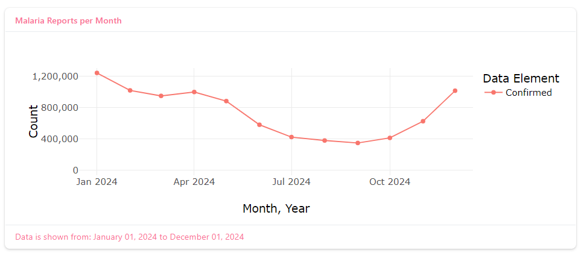

Right now, our dashboard shows only Confirmed malaria cases over time. But what if users want to compare trends for Confirmed, Clinical, and Tested data - without cluttering the same plot?

We can achieve this using a tabbed card layout. This makes your dashboard more interactive and gives users control over what data they explore.

A `navset_card_tab()` lets you place multiple tabs within a single card. Each tab can show different content - in our case, a different dataset or visualization - while keeping a unified, styled appearance.

We’ll build one tab per data type:

-   Confirmed - lab-confirmed malaria cases

-   Clinical - clinically diagnosed malaria cases

-   Tested - total malaria tests reported

Replace your existing single `card()` block with a tabbed card layout. Each tab will have its own plot output.

```{r eval = FALSE}

    # Card
    layout_columns(
      navset_card_tab(
        height = 400,
        full_screen = TRUE,
        card_header("Monthly Malaria Indicators"),
        # --- Tab 1: Confirmed ---
        nav_panel(
          "Confirmed",
          plotlyOutput("plot_confirmed")
        ),
        
        # --- Tab 2: Clinical ---
        nav_panel(
          "Clinical",
          plotlyOutput("plot_clinical")
        ),
        
        # --- Tab 3: Tested ---
        nav_panel(
          "Tested",
          plotlyOutput("plot_tested")
        ),
        
        # --- Dynamic footer 
        card_footer(uiOutput("footer_text"))
        
      )
    )

```

`navset_card_tab()` wraps all tabs in one interactive container.

`nav_panel()` creates each labeled tab.

We now need separate `renderPlotly()` outputs - one per tab - using filtered subsets of the data.

Let’s create a small helper function to avoid repetitionof our code, and then call it three times to create the plots.

We place the helper function outside of the `ui` and `server` code just after we read our data in:

```{r eval = FALSE}
#-Read in data for the application---------------------------------------------
# Ensure the correct file paths for your project
dhis2_data <-
  readRDS("data/dhis2-dashboard-clean.RDS")

province_shp <- readRDS("data/province-shp-clean.RDS") # shapefiles
district_shp <- readRDS("data/district-shp-clean.RDS") # shapefiles
pop_data <- readRDS("data/pop-data.RDS") # population data

#-helper function to create plots----------------------------------------------
make_time_plot <- function(df, data_type_name) {
  df_filtered <-
    df |>
    filter(data_type == data_type_name) |>
    group_by(period, data_type) |>
    summarise(count = sum(count, na.rm = TRUE))

  p <- ggplot(
    df_filtered,
    aes(x = period, y = count, col = data_type)
  ) +
    geom_point() +
    geom_line() +
    labs(
      x = "Month, Year",
      y = "Count",
      col = NULL
    ) +
    theme_minimal(14) +
    scale_y_continuous(labels = comma, limits = c(0, NA))

  ggplotly(p)
}

```

And then replace the server code we currently have with this much smaller update:

```{r eval = FALSE}
#-Plot outputs----------------------------------------
  output$plot_confirmed <- renderPlotly({
    make_time_plot(filtered_data(), "Confirmed")
  })

  output$plot_clinical <- renderPlotly({
    make_time_plot(filtered_data(), "Clinical")
  })

  output$plot_tested <- renderPlotly({
    make_time_plot(filtered_data(), "Tested")
  })
```

`make_time_plot()` is a custom mini-function that takes your reactive dataset and a case type, then builds a consistent Plotly chart.

You can reuse this function across multiple tabs - it keeps your server code cleaner.

Each tab references a separate output ID, matching those defined in your UI.


Lets also make the colours of our plot match the same colour for the data_element in the `value_boxes`.

```{r eval = FALSE}
    scale_color_manual(values = c(
      "Confirmed" = "#6D475F",
      "Clinical" = "#95AFF1",
      "Tested" = "#C3A3EF"
    ))

```

### Exercide 10

10. Where else in our application code might we benefit from writing a function to reduce repetitive code in the `server`?

::: {.callout-tip collapse="true" title="Show Solution"}
The code that we are currently using the create the value box summary text could also be a single function that we call for each of the indicators.

Like this:

```{r eval = FALSE}
#-helper function to summarise for value boxes----------------------------------
value_box_val <- function(df, data_type_name) {
  total <-
    df %>%
    # filters to confirmed malaria cases
    filter(data_type %in% data_type_name) %>%
    # sums over all locations and year(s) selected by the user
    summarise(total = sum(count, na.rm = TRUE)) %>%
    # pulls out the value from summary calculation into named vector
    pull(total)

  # Format with commas for readability
  formatted_total <- scales::comma(total)

  paste0(formatted_total)
}

```

```{r eval = FALSE}
  #-Value Box Values-----------------------------------
  output$value_conf <- renderText({
    value_box_val(filtered_data(), "Confirmed")
  })

  output$value_test <- renderText({
    value_box_val(filtered_data(), "Tested")
  })

  output$value_clin <- renderText({
    value_box_val(filtered_data(), "Clinical")
  })

  output$value_total_cases <- renderText({
    value_box_val(filtered_data(), c("Clinical", "Confirmed"))
  })

```
:::

## Plotting enhancements - toggle switches

Our dashboard now looks great with the tabbed card layout, but right now users can only view one year at a time. Let’s take it a step further by allowing users to *compare trends across multiple years* - all within the same plots.

This feature helps answer questions like:

-   “How did malaria cases in 2023 compare to 2022 or 2021?”

We’ll add a **toggle button** that lets users switch between single-year view and multi-year comparison view and we'll add the toggel directly in the card header.

Placing the toggle inside the card makes the interaction feel contextual. The user can instantly change how the chart is displayed - without scrolling to the sidebar.

```{r eval = FALSE}
    # Card
    layout_columns(
      navset_card_tab(
        height = 400,
        full_screen = TRUE,
        title = "Monthly Malaria Indicators",

        # --- Toggle switch---
        checkboxInput(
          inputId = "compare_years",
          label = "Compare years",
          value = FALSE
        ),
        # --- Tabs for each data type ---
        nav_panel("Confirmed", plotlyOutput("plot_confirmed")),
        nav_panel("Clinical", plotlyOutput("plot_clinical")),
        nav_panel("Tested", plotlyOutput("plot_tested")),

        # --- Footer summary text ---
        card_footer(uiOutput("footer_text"))
      )
    )
```

The toggle (`checkboxInput`) works the same as before, but now lives inside the visualization container.

We’ll update our plotting logic so that when the user turns Compare Years ON, the plot displays multiple colored lines - one per year.

When the toggle is OFF, it returns to showing only the selected year.

We update the `make_time_plot()` function we had before so that: - Single-year mode → Filters for the selected year and shows monthly counts.

-   Compare-years mode → Plots every year as a separate colored line on the same axis.

```{r eval = FALSE}

make_time_plot <- function(df, data_type_name, compare_years) {
 
   # For single year plot as before
  if (!isTRUE(compare_years)) {
    # ---- Single-year view (uses reactive df) ----
    df_filtered <- df |>
      dplyr::filter(data_type == data_type_name) |>
      dplyr::group_by(period, data_type) |>
      dplyr::summarise(count = sum(count, na.rm = TRUE), .groups = "drop")

    # guard against empty data
    if (nrow(df_filtered) == 0) {
      return(NULL)
    }

    p <- ggplot(
      df_filtered,
      aes(x = period, y = count, col = data_type)
    ) +
      geom_point() +
      geom_line() +
      labs(
        x = "Month, Year",
        y = "Count",
        col = NULL
      ) +
      theme_minimal(14) +
      scale_y_continuous(labels = scales::comma, limits = c(0, NA)) +
      scale_color_manual(values = c(
        "Confirmed" = "#6D475F",
        "Clinical"  = "#95AFF1",
        "Tested"    = "#C3A3EF"
      ))

    return(plotly::ggplotly(p))
  } else {
    # ---- Compare-years view (use all years) ----
    df_filtered <- dhis2_data |>
      dplyr::filter(data_type == data_type_name) |>
      dplyr::group_by(period, year, data_type) |>
      dplyr::summarise(count = sum(count, na.rm = TRUE), .groups = "drop") |>
      dplyr::mutate(
        month = lubridate::month(period),
        year  = as.factor(year)
      )

    if (nrow(df_filtered) == 0) {
      return(NULL)
    }

    p <- ggplot(
      df_filtered,
      aes(x = month, y = count, col = year, group = year)
    ) +
      geom_line(linewidth = 1) +
      geom_point(size = 1.5) +
      scale_x_continuous(breaks = 1:12, labels = month.abb) +
      labs(
        x = "Month",
        y = "Count",
        col = "Year"
      ) +
      theme_minimal(14) +
      scale_y_continuous(labels = scales::comma, limits = c(0, NA)) +
      scale_color_brewer(palette = "Set2")

    return(plotly::ggplotly(p))
  }
}

```

-   The function uses `if (!isTRUE(compare_years))` ... `else` ... so that only one branch runs.

-   Each branch returns its Plotly chart, preventing Shiny from receiving `NULL`.

-   `month(period)` converts your date variable into a simple month for clean comparison across years.

-   The Set2 palette gives clear, distinct colors for each year.

To render the plots we then need to pass your toggle’s value (`input$compare_years`) to the `server` code too:

```{r eval = FALSE}
#-Plot outputs----------------------------------------
  output$plot_confirmed <- renderPlotly({
    make_time_plot(filtered_data(), "Confirmed", compare_years = input$compare_years)
  })

  output$plot_clinical <- renderPlotly({
    make_time_plot(filtered_data(), "Clinical", compare_years = input$compare_years)
  })

  output$plot_tested <- renderPlotly({
    make_time_plot(filtered_data(), "Tested", compare_years = input$compare_years)
  })
```

✅ Test It Out!

-   Run your app.

-   Check that the “Compare years” toggle switches smoothly:

-   Off → a single line for the selected year.

-   On → multiple colored lines, one per year.

-   Hover over points to see counts per month and year.

> If there are specific years you want to compare you can also toggle the years displayed by clicking the years in the legend to show or hide the lines!

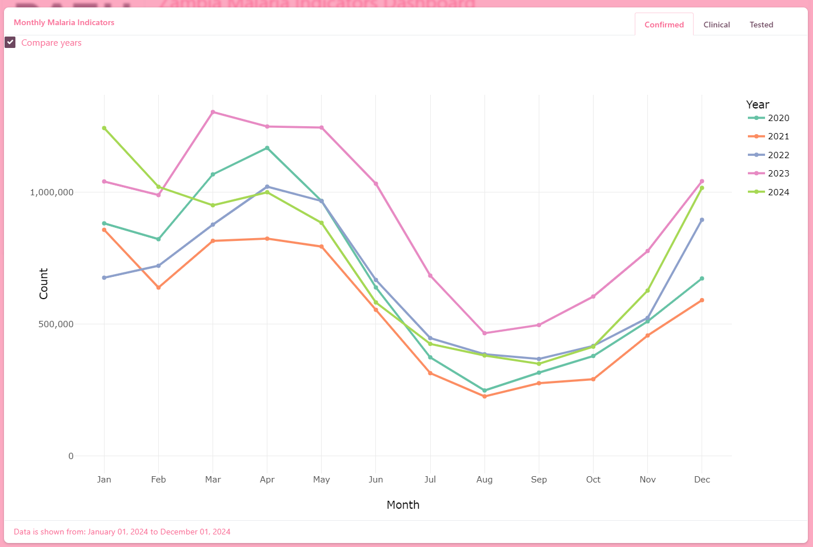

Recap

In this step, you learned how to:

-   Write a reusable plotting function that adapts to user selections.

-   Return interactive Plotly objects from within an `if…else` structure.

-   Add contextual controls inside a card header for a clean, modern UX.

-   Compare temporal patterns across years with minimal extra code.

## Plotting enhancements - calculated variables

One of the powerful benefits of building dashboards in R is that we can compute new indicators directly inside our Shiny app using the data already loaded.

Let’s take **Test Positivity Rate (TPR)** as an example. This isn’t directly stored in our dataset but can easily be computed:

> **TPR = Confirmed Cases / Malaria Tests**

###Step 1 - Add a new “TPR” tab

In your `UI`, add one more `nav_panel()` to your `navset_card_tab()` that will display the TPR plot.

::: {.callout-tip collapse="true" title="Show Solution"}
```{r eval = FALSE}
# ... inside navset_card_tab(...)
nav_panel("Confirmed", plotlyOutput("plot_confirmed")),
nav_panel("Clinical",  plotlyOutput("plot_clinical")),
nav_panel("Tested",    plotlyOutput("plot_tested")),

# --- New tab ---
nav_panel("TPR",       plotlyOutput("plot_tpr")),

```
:::

### Step 2 - Compute TPR from our data

Our dataset doesn’t contain a “TPR” column, but it does contain the two pieces we need: the number of Confirmed cases and the number of Tested cases.

We’ll compute TPR inside the app each time the user changes inputs (year or compare toggle).

We add these additional functions to the top of our script:

```{r eval = FALSE}
#-A small helper to avoid dividing by zero-----------------------------
safe_divide <- function(num, den) ifelse(den > 0, num / den, NA_real_)

#-A function to compute monthly TPR------------------------------------
compute_tpr_monthly <- function(df) {
  # 1. Keep only the data we need
  summed <-
    df |>
    dplyr::filter(data_type %in% c("Confirmed", "Tested")) |>
    dplyr::group_by(period, year, data_type) |>
    dplyr::summarise(count = sum(count, na.rm = TRUE), .groups = "drop_last") |>
    # 2. Reshape from long → wide so we have columns Confirmed and Tested
    tidyr::pivot_wider(
      names_from  = data_type,
      values_from = count,
      values_fill = 0
    ) |>
    dplyr::ungroup()

  # 3. Calculate TPR
  summed <- summed |>
    dplyr::mutate(TPR = safe_divide(Confirmed, Tested))

  # 4. For compare view, add month number for plotting
  summed <- summed |>
    dplyr::mutate(
      month = lubridate::month(period),
      year  = as.factor(year)
    )

  summed
}
```

What’s happening here:

-   We first filter the data so we only keep rows for “Confirmed” and “Tested”.

-   We group by time to make monthly totals.

-   We pivot to get two columns - Confirmed and Tested.

-   We calculate TPR safely (avoiding division by 0).

When comparing years, we extract the month number so that different years can be overlaid on the same axis.

This is how we transform raw counts into a brand-new metric right inside the dashboard.

### Step 3 - Create the TPR plot function

Next, we’ll build a plotting helper, similar to the ones you already used. This lets us reuse the same logic for both single-year and compare-years views.

```{r eval = FALSE}
#-TPR plotting function-----------------------------------------
make_tpr_plot <- function(df, compare_years, select_year) {
  # Step 1: calculate the data we need
  tpr_df <- compute_tpr_monthly(df)

  # Step 2: stop if there’s no data
  if (nrow(tpr_df) == 0) {
    return(NULL)
  }

  # Step 3: build the plot
  if (!isTRUE(compare_years)) {
    # ---- Single-year plot ----
    p <- ggplot(
      tpr_df |>
        filter(year == select_year),
      aes(x = period, y = TPR)
    ) +
      geom_point() +
      geom_line() +
      labs(
        x = "Month, Year",
        y = "TPR"
      ) +
      theme_minimal(14) +
      scale_y_continuous(labels = scales::percent, limits = c(0, 1))
  } else {
    # ---- Compare-years plot ----
    p <- ggplot(
      tpr_df,
      aes(x = month, y = TPR, col = year, group = year)
    ) +
      geom_line(linewidth = 1) +
      geom_point(size = 1.5) +
      scale_x_continuous(breaks = 1:12, labels = month.abb) +
      labs(
        x = "Month",
        y = "TPR",
        col = "Year"
      ) +
      theme_minimal(14) +
      scale_y_continuous(labels = scales::percent, limits = c(0, 1)) +
      scale_color_brewer(palette = "Set2")
  }

  plotly::ggplotly(p)
}

```

-   if (!isTRUE(compare_years)) handles the normal single-year mode.

-   When comparing, we use month on the x-axis and year for color, so each year’s line overlays nicely.

-   scale_y_continuous(labels = scales::percent) displays TPR in % format, making it easier to read.

### Step 4 - Connect the plot to the UI tab

Now, tell Shiny to render the new plot.

Add this code below your other `renderPlotly()` blocks:

```{r eval= FALSE}
  output$plot_tpr <- renderPlotly({
    make_tpr_plot(dhis2_data, input$compare_years, input$dropdown_year)
  })
```

This connects your new TPR plot to the “TPR” tab you added earlier.

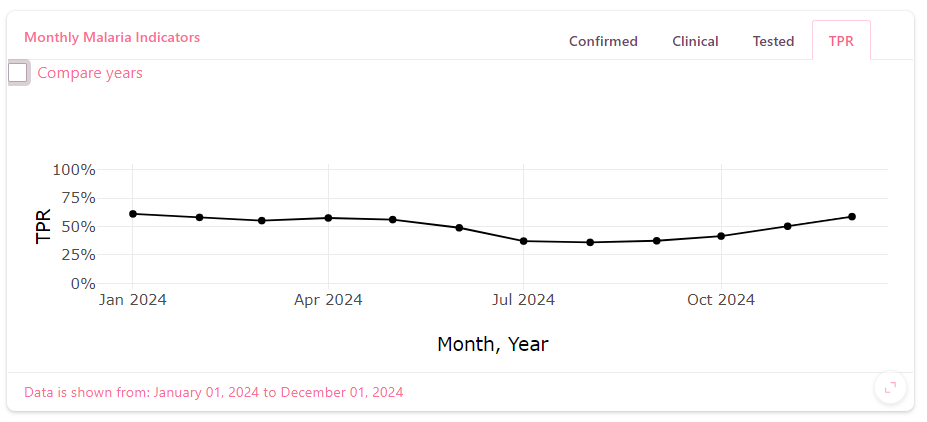

### Step 5 - Run and Explore

-   Try out the dashboard!

-   Click the TPR tab → you should see the Test Positivity Rate for the selected year.

-   Turn on Compare years → each year appears as a separate colored line.

-   Hover → see monthly TPR values as percentages.

### Recap

In this section you learned:

✅ How to create a derived variable directly inside Shiny.

✅ How to pivot and summarise data to prepare new indicators.

✅ How to extend your tabbed card with an additional plot.

✅ How to reuse your existing compare years logic to make every indicator more dynamic.

::: {.callout-caution title="What do you think?"}
You may notice that the **hover labels** on our Plotly charts aren’t as polished as they could be.

Right now, they’re showing the raw column names and values directly from our dataset - which works, but isn’t always very informative for end users.

The good news is that Plotly allows you to **customize hover tooltips** easily.

For example, you can:

-   Round numbers or format percentages neatly (e.g., show *45.3%* instead of *0.453*).

-   Reorder or rename fields to make them more descriptive (e.g., “Month: January” instead of “period”).

-   Add extra context like “National TPR” or “Province name” right in the hover box.

Add the following inside your `aes()` calls in your `make_tpr_plot()` function:

```{r eval= FALSE}
aes(
    # existing code...
    # Custom hover label text
    text = paste0(
      "<b>Year:</b> ", year,
      "<br><b>Month:</b> ", month.abb[month],
      "<br><b>TPR:</b> ", scales::percent(TPR, accuracy = 0.1)
    )
  )

```

Then, when converting to Plotly, specify that the hover text should come from this new field: `ggplotly(p, tooltip = "text")`

**What this does:**

-   Adds HTML-style `<b>` bold formatting for cleaner, readable tooltips.

-   Converts TPR to a rounded percentage using `scales::percent()`.

-   Replaces column names with friendly labels like **Year**, **Month**, and **TPR**.

-   The `tooltip = "text"` option tells Plotly to display only your custom hover text, rather than every aesthetic value.

Hover over your new TPR plot - it should now look more like this:

**Year**: 2023

**Month**: February

**TPR**: 45.7%\

> Can you make the hover labels on the other plots cleaner too?
:::

## Plotting Enhancements: Maps (Incidence by Province & District)

In this section, we’ll add **two interactive maps** side-by-side:

-   a **Province**-level map of **malaria incidence** for the selected year

-   a **District**-level map of **malaria incidence** for the selected year

-   We’ll compute **incidence** on the fly:

> **Incidence per 1,000 = Confirmed Cases / Population × 1,000**

We’ll then **join** the results to your shapefiles and render with **leaflet**.

### Step 1 - Create reactives to compute incidence per level

Add these inside your **server()** function. These will:

1.  filter to the **selected year** and **Confirmed & Clinical malaria**

2.  aggregate to **province** / **district**

3.  join to **population**

4.  compute **incidence per 1,000**

```{r eval = FALSE}
#-Province-level incidence reactive-------------------------
  province_incidence <- reactive({
    req(input$dropdown_year)

    # 1) Cases: province-year totals
    prov_cases <- dhis2_data |>
      filter(year == input$dropdown_year, data_type %in% c("Confirmed", "Clinical")) |>
      group_by(province, year) |>
      summarise(confirmed = sum(count, na.rm = TRUE), .groups = "drop")

    # 2) Population: province-year
    prov_pop <- pop_data |>
      filter(year == input$dropdown_year) |>
      group_by(province, year) |>
      summarise(population = sum(pop, na.rm = TRUE), .groups = "drop")

    # 3) Join + compute incidence
    prov_df <- prov_cases |>
      left_join(prov_pop, by = c("province", "year")) |>
      mutate(inc_per_1k = ifelse(population > 0, (confirmed / population) * 1000, NA_real_))

    prov_df
  })

  #---District-level incidence reactive-----------------------------
  district_incidence <- reactive({
    req(input$dropdown_year)

    dist_cases <- dhis2_data |>
      filter(year == input$dropdown_year, data_type %in% c("Confirmed", "Clinical")) |>
      group_by(province, district, year) |>
      summarise(confirmed = sum(count, na.rm = TRUE), .groups = "drop")

    dist_pop <- pop_data |>
      filter(year == input$dropdown_year) |>
      group_by(province, district, year) |>
      summarise(population = sum(pop, na.rm = TRUE), .groups = "drop")

    dist_df <- dist_cases |>
      left_join(dist_pop, by = c("province", "district", "year")) |>
      mutate(inc_per_1k = ifelse(population > 0, (confirmed / population) * 1000, NA_real_))

    dist_df
  })
```

### Step 2 - Join incidence to shapefiles

We’ll attach the computed incidence to the corresponding shapefiles.

Add the following to your `server()` function

```{r eval = FALSE}
# Province shapes with incidence
province_map_sf <- reactive({
  shp <- province_shp
  dat <- province_incidence()
  dplyr::left_join(shp, dat, by = "province")
})

# District shapes with incidence
district_map_sf <- reactive({
  shp <- district_shp
  dat <- district_incidence()
  dplyr::left_join(shp, dat, by = c("province","district"))
})

```

### Step 3 - Define palettes

We’ll use a **bin** palette so the legend is easy to read - we should always examine our data and iterate on the most appropriate selection of breaks for our pallette. Add the following functions to the top of our script with our other helper functions.

```{r eval = FALSE}
#-Helper to build a palette from current data-----------------------
make_inc_palette <- function(vals) {
  leaflet::colorBin(
    palette = "YlOrRd",
    domain  = vals,
    bins    = c(0, 10, 50, 100, 200, 500, 900, Inf),
    na.color = "#f0f0f0"
  )
}

```

### Step 4 - Render the Leaflet maps

We’ll create two `renderLeaflet()` outputs.\
They will:

-   build a palette from the current incidence values

-   add polygons with hover labels

-   add a legend

-   highlight on hover

Now buid the Maps using Leaflet Syntax in the `server()`. This is slightly different syntax to plotting using `ggplot2` and each arguement is described below.

```{r eval = FALSE}
# --- Province-level map output ---
output$map_province <- leaflet::renderLeaflet({
  
  # Ensure the reactive dataset exists before rendering
  req(province_map_sf())
  
  # Retrieve the spatial dataset (an sf object with incidence values)
  sf_obj <- province_map_sf()
  
  # Create a color palette function based on incidence values
  pal <- make_inc_palette(sf_obj$inc_per_1k)
  
  # Begin building a leaflet map using the province-level sf object
  leaflet::leaflet(sf_obj, options = leaflet::leafletOptions(minZoom = 4)) |>
    
    # Add a light grey background tile layer for context (CartoDB style)
    leaflet::addProviderTiles(leaflet::providers$CartoDB.Positron) |>
    
    # Add province polygons, one for each feature in the sf object
    leaflet::addPolygons(
      # Fill each polygon based on the incidence value
      fillColor = ~ pal(inc_per_1k),
      # Outline color for province borders
      color = "#444444",
      # Line weight (thickness) of the borders
      weight = 1,
      # How opaque the polygon fill should be (0 = transparent, 1 = solid)
      fillOpacity = 0.8,
      # Tooltip text shown on hover (one per province)
      label = ~ paste0(province, ": ", round(inc_per_1k, 0), " per 1,000"),
      # Visual highlighting when the user hovers over a province
      highlightOptions = leaflet::highlightOptions(
        weight = 2,            # Thicker border when highlighted
        color = "#333333",     # Darker outline color
        bringToFront = TRUE    # Bring the highlighted shape to the front
      )
    ) |>
    
    # Add a legend showing color bins for incidence per 1,000 population
    leaflet::addLegend(
      pal = pal,                     # Palette function defined above
      values = ~inc_per_1k,          # Variable mapped to color
      position = "bottomright",      # Legend placement on map
      title = "Incidence per 1,000"  # Legend title
    )
})


# --- District-level map output ---
output$map_district <- leaflet::renderLeaflet({
  
  # Ensure the reactive dataset exists before rendering
  req(district_map_sf())
  
  # Retrieve the spatial dataset (district-level sf object)
  sf_obj <- district_map_sf()
  
  # Create a color palette based on district-level incidence values
  pal <- make_inc_palette(sf_obj$inc_per_1k)
  
  # Build the leaflet map
  leaflet::leaflet(sf_obj, options = leaflet::leafletOptions(minZoom = 4)) |>
    
    # Add base map tiles for background context
    leaflet::addProviderTiles(leaflet::providers$CartoDB.Positron) |>
    
    # Add polygons for each district
    leaflet::addPolygons(
      fillColor = ~ pal(inc_per_1k),     # Fill color determined by incidence value
      color = "#444444",                 # Border color
      weight = 0.6,                      # Thinner border for finer detail
      fillOpacity = 0.8,                 # Transparency of fill
      # Tooltip label combining province and district names + incidence
      label = ~ paste0(
        province, ", ", district, ": ", 
        round(inc_per_1k, 0), " per 1,000"
      ),
      # Highlight styling when hovering over a district
      highlightOptions = leaflet::highlightOptions(
        weight = 2,            # Thicker border on hover
        color = "#333333",     # Darker border color
        bringToFront = TRUE    # Bring hovered feature to top
      )
    ) |>
    
    # Add a legend in the bottom-right corner
    leaflet::addLegend(
      pal = pal,                     # Same palette as polygons
      values = ~inc_per_1k,          # Variable for legend bins
      position = "bottomright",      # Legend location
      title = "Incidence per 1,000"  # Legend title
    )
})

```

### Step 5 - Add two cards side-by-side in the UI

Use `layout_columns()` to place two map cards in a row. You can decide on where to place the maps based on where in the `ui` you place the code below. For example if you place it after the value boxes and before the current card this is where in the app the maps will apear. if you place it at the end after the current card, the maps will be at the bottom of the page.

```{r eval = FALSE}
# --- In your UI, where you want the maps to appear ---
layout_columns(
  # Province card
  card(
    full_screen = TRUE,
    card_header("Incidence per 1,000 - Province"),
    card_body(leafletOutput("map_province", height = 450))
  ),
  # District card
  card(
    full_screen = TRUE,
    card_header("Incidence per 1,000 - District"),
    card_body(leafletOutput("map_district", height = 450))
  )
)

```

\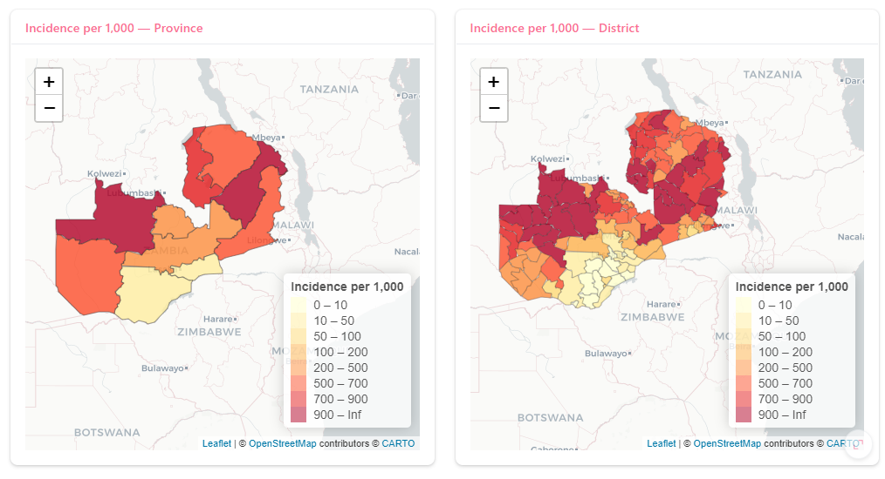

In the current app, your `leaflet()` map uses: `addProviderTiles(providers$CartoDB.Positron)`

This adds a light, minimal background map. But what if you wanted to give users a different map style?

### Exercise 11

11. Explore other available background tiles using the `leaflet::providers` object. You can see a full list by running this command in your R console: `leaflet::providers` Replace `CartoDB.Positron` with another of your choice. **Hint:** You only need to replace the argument to `addProviderTiles()`. For example: `addProviderTiles(providers$Esri.WorldImagery)`

## Selection levels - allowing the user to select level of data displayed

So far, your dashboard has shown **national-level data** only. But in real malaria monitoring, analysts need to focus on **specific provinces** or **districts** - and see those areas highlighted on maps.

In this section, we’ll:

1.  Add new sidebar controls to select **Display Level**

2.  Dynamically show Province/District pickers when needed

3.  Filter all plots and value boxes based on user selections

4.  Highlight the chosen area’s outline on the maps

### Step 1 - Add Level Selection Controls to the Sidebar

Let’s start by adding three input controls inside your `sidebar = list()` block in the **`UI`**:

```{r eval = FALSE}
      # --- Select the spatial scale ---
      radioButtons(
        "level", "Display level",
        choices = c("National", "Province", "District"),
        selected = "National", inline = TRUE
      ),
      
      # --- Province select (shown when level ≠ National) ---
      conditionalPanel(
        condition = "input.level !== 'National'",
        selectInput(
          "province", "Province",
          choices = sort(unique(province_shp$province)),
          selected = sort(unique(province_shp$province))[1]
        )
      ),
      
      # --- District select (shown when level = District) ---
      conditionalPanel(
        condition = "input.level == 'District'",
        selectInput(
          "district", "District",
          choices = sort(unique(district_shp$district)),
          selected = sort(unique(district_shp$district))[1]
        )
      )

```

-   The `radioButtons()` lets the user pick between National, Province, or District.

-   `conditionalPanel()` makes a control appear **only when** a certain condition is true (checked via `input.level`).

### Step 2 - Make the District List Update Automatically

We’ll use an **observer** that listens for changes to the selected province and updates the district list accordingly so that only districts in that province are available for selection.

Add this in your **`server`**`()`:

```{r eval = FALSE}

observeEvent(list(input$province, input$level), {
  # Only update when viewing the District level
  if (input$level != "District") return()

  # Filter district list to chosen province
  districts_in_province <- district_shp |>
    dplyr::filter(province == input$province) |>
    dplyr::pull(district) |>
    unique() |>
    sort()

  # If no districts found, default to full list
  if (length(districts_in_province) == 0) {
    districts_in_province <- sort(unique(district_shp$district))
  }

  updateSelectInput(
    inputId = "district",
    choices = districts_in_province,
    selected = districts_in_province[1]
  )
})
```

Which will give you something like this when you run the app:

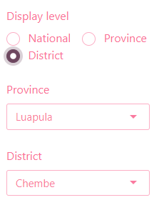

When a user picks a different province, the available district list should update.\

`observeEvent()` reacts to the change and uses `updateSelectInput()` to refresh the dropdown.

### Step 3 - Create Reactives that Filter Data by Level

Now we need to tell the app what to do when we select a different level so we’ll create two reactive datasets:

-   `data_selected_year_level()` - for **single-year** views (value boxes and main plots)

-   `data_all_years_level()` - for **compare-years** plots

Replace our current `filtered_data()` reactive with these new calls:

```{r eval= FALSE}
# --- Reactive: Data for the selected year & level ---
data_selected_year_level <- reactive({
  df <- dplyr::filter(dhis2_data, year == input$dropdown_year)

  if (input$level == "Province") {
    df <- dplyr::filter(df, province == input$province)
  } else if (input$level == "District") {
    df <- dplyr::filter(df, province == input$province, district == input$district)
  }

  df
})

# --- Reactive: Data for all years (used for compare-years plots) ---
data_all_years_level <- reactive({
  df <- dhis2_data
  if (input$level == "Province") {
    df <- dplyr::filter(df, province == input$province)
  } else if (input$level == "District") {
    df <- dplyr::filter(df, province == input$province, district == input$district)
  }
  df
})
```

These functions check which `“level”` and `year` is selected and filter the dataset accordingly.

### Step 4 - Use the New Reactives outputs

Update your `output$date_text_test` code to use `df <- data_selected_year_level()` and do the same in you `output$footer_text` code too.

Next Update the value boxes, replace your existing value box render calls with:

```{r eval = FALSE}
output$value_conf <- renderText({
  value_box_val(data_selected_year_level(), "Confirmed")
})
output$value_test <- renderText({
  value_box_val(data_selected_year_level(), "Tested")
})
output$value_clin <- renderText({
  value_box_val(data_selected_year_level(), "Clinical")
})
output$value_total_cases <- renderText({
  value_box_val(data_selected_year_level(), c("Clinical", "Confirmed"))
})
```

Each value box now reflects the selected spatial scale and year.

Update your Plot Calls

Modify your plot render functions so they use both reactives:

```{r eval = FALSE}
output$plot_confirmed <- renderPlotly({
  make_time_plot(
    df = data_selected_year_level(),
    data_type_name = "Confirmed",
    compare_years = input$compare_years,
    df_all_years = data_all_years_level()
  )
})

output$plot_clinical <- renderPlotly({
  make_time_plot(
    data_selected_year_level(), "Clinical",
    input$compare_years, data_all_years_level()
  )
})

output$plot_tested <- renderPlotly({
  make_time_plot(
    data_selected_year_level(), "Tested",
    input$compare_years, data_all_years_level()
  )
})

output$plot_tpr <- renderPlotly({
  make_tpr_plot(
    df = data_all_years_level(),
    compare_years = input$compare_years,
    select_year = input$dropdown_year
  )
})
```

The next thing we need to do is update the plotting function code to work with our new reactive datasets:

Make the helpers take both the selected-year, level-filtered data and the all-years, level-filtered data.

Update `make_time_plot()`

What changes?

-   Add a new argument: `df_all_years`.

-   In single-year mode, use `df` (already filtered to selected year + level).

-   In compare-years mode, use `df_all_years` (filtered to level, but across all years).

```{r eval = FALSE}
#-helper function to create plots----------------------------------------------
# df            = selected-year dataset, already filtered by level (National/Province/District)
# data_type_name = "Confirmed" | "Clinical" | "Tested"
# compare_years = TRUE/FALSE (toggle)
# df_all_years  = all-years dataset, already filtered by the same level
make_time_plot <- function(df, data_type_name, compare_years, df_all_years) {
  
  if (!isTRUE(compare_years)) {
    # ---- Single-year view (uses df) ----
    df_filtered <- df |>
      dplyr::filter(data_type == data_type_name) |>
      dplyr::group_by(period, data_type) |>
      dplyr::summarise(count = sum(count, na.rm = TRUE), .groups = "drop")

    if (nrow(df_filtered) == 0) return(NULL)

    p <- ggplot(
      df_filtered,
      aes(x = period, y = count, col = data_type)
    ) +
      geom_point() +
      geom_line() +
      labs(x = "Month, Year", y = "Count", col = NULL) +
      theme_minimal(14) +
      scale_y_continuous(labels = scales::comma, limits = c(0, NA)) +
      scale_color_manual(values = c(
        "Confirmed" = "#6D475F",
        "Clinical"  = "#95AFF1",
        "Tested"    = "#C3A3EF"
      ))

    return(plotly::ggplotly(p))

  } else {
    # ---- Compare-years view (uses df_all_years) ----
    df_filtered <- df_all_years |>
      dplyr::filter(data_type == data_type_name) |>
      dplyr::group_by(period, year, data_type) |>
      dplyr::summarise(count = sum(count, na.rm = TRUE), .groups = "drop") |>
      dplyr::mutate(
        month = lubridate::month(period),
        year  = as.factor(year)
      )

    if (nrow(df_filtered) == 0) return(NULL)

    p <- ggplot(
      df_filtered,
      aes(x = month, y = count, col = year, group = year)
    ) +
      geom_line(linewidth = 1) +
      geom_point(size = 1.5) +
      scale_x_continuous(breaks = 1:12, labels = month.abb) +
      labs(x = "Month", y = "Count", col = "Year") +
      theme_minimal(14) +
      scale_y_continuous(labels = scales::comma, limits = c(0, NA)) +
      scale_color_brewer(palette = "Set2")

    return(plotly::ggplotly(p))
  }
}
```

### Step 5 - Update the server plot calls

Now that the helpers are ready, you can safely change the server code to pass:

-    `data_selected_year_level()` for single-year mode

-   `data_all_years_level()` for compare-years mode

```{r eval = FALSE}
output$plot_confirmed <- renderPlotly({
  make_time_plot(
    df            = data_selected_year_level(),
    data_type_name = "Confirmed",
    compare_years  = input$compare_years,
    df_all_years   = data_all_years_level()
  )
})

output$plot_clinical <- renderPlotly({
  make_time_plot(
    data_selected_year_level(), "Clinical",
    input$compare_years, data_all_years_level()
  )
})

output$plot_tested <- renderPlotly({
  make_time_plot(
    data_selected_year_level(), "Tested",
    input$compare_years, data_all_years_level()
  )
})

output$plot_tpr <- renderPlotly({
  make_tpr_plot(
    df            = data_all_years_level(),   # all-years, level-filtered
    compare_years = input$compare_years,
    select_year   = input$dropdown_year
  )
})
```

### Step 6 - Map highlights

When a user selects a **Province** or **District**, it helps to reinforce that choice visually on the maps.\

We’ll draw a **bold outline** around the selected area.

We'll add the following to our code:

1.   Two small **reactives** that return the selected province/district geometries

2.   Extra **polylines** layers to display crisp outlines on both maps

Add these inside your **`server`** (near your other map reactives).\

They each return a 1-row `sf` object

```{r eval = FALSE}
# Selected province outline (returns 1 row sf or NULL)
selected_province_outline <- reactive({
  if (input$level == "National") return(NULL)
  shp <- province_shp |>
    dplyr::filter(province == input$province)
  if (nrow(shp) == 0) return(NULL)
  shp
})

# Selected district outline (returns 1 row sf or NULL)
selected_district_outline <- reactive({
  if (input$level != "District") return(NULL)
  shp <- district_shp |>
    dplyr::filter(province == input$province, district == input$district)
  if (nrow(shp) == 0) return(NULL)
  shp
})

```

We’ll keep your base map code and append an extra `addPolylines()` **after** the polygons so the outline sits on top. Replace your map code with the following:

```{r eval = FALSE}
# Province level map
output$map_province <- leaflet::renderLeaflet({
  req(province_map_sf())

  sf_obj <- province_map_sf()
  pal <- make_inc_palette(sf_obj$inc_per_1k)

  m <- leaflet::leaflet(sf_obj, options = leaflet::leafletOptions(minZoom = 4)) |>
    leaflet::addProviderTiles(leaflet::providers$CartoDB.Positron) |>
    leaflet::addPolygons(
      fillColor = ~ pal(inc_per_1k),
      color = "#444444", weight = 1, fillOpacity = 0.8,
      label = ~ paste0(province, ": ", round(inc_per_1k, 0), " per 1,000"),
      highlightOptions = leaflet::highlightOptions(weight = 2, color = "#333333", bringToFront = TRUE)
    ) |>
    leaflet::addLegend(
      pal = pal, values = ~inc_per_1k,
      position = "bottomright",
      title = "Incidence per 1,000"
    )

  # --- draw selected province outline on top (if applicable) ---
  sel_prov <- selected_province_outline()
  if (!is.null(sel_prov)) {
    m <- m |>
      leaflet::addPolylines(
        data = sel_prov,
        color = "#6D475F",  # use your theme accent
        weight = 4,         # thicker to stand out
        opacity = 1,
        fill = FALSE
      )
  }

  m
})
```

```{r eval = FALSE}
# distrinct level map
output$map_district <- leaflet::renderLeaflet({
  req(district_map_sf())

  sf_obj <- district_map_sf()
  pal <- make_inc_palette(sf_obj$inc_per_1k)

  m <- leaflet::leaflet(sf_obj, options = leaflet::leafletOptions(minZoom = 4)) |>
    leaflet::addProviderTiles(leaflet::providers$CartoDB.Positron) |>
    leaflet::addPolygons(
      fillColor = ~ pal(inc_per_1k),
      color = "#444444", weight = 0.6, fillOpacity = 0.8,
      label = ~ paste0(province, ", ", district, ": ", round(inc_per_1k, 0), " per 1,000"),
      highlightOptions = leaflet::highlightOptions(weight = 2, color = "#333333", bringToFront = TRUE)
    ) |>
    leaflet::addLegend(
      pal = pal, values = ~inc_per_1k,
      position = "bottomright",
      title = "Incidence per 1,000"
    )

  # --- province outline (for context) ---
  sel_prov <- selected_province_outline()
  if (!is.null(sel_prov)) {
    m <- m |>
      leaflet::addPolylines(
        data = sel_prov,
        color = "#6D475F",
        weight = 3,
        opacity = 1,
        fill = FALSE
      )
  }

  # --- district outline (only when level = District) ---
  sel_dist <- selected_district_outline()
  if (!is.null(sel_dist)) {
    m <- m |>
      leaflet::addPolylines(
        data = sel_dist,
        color = "#6D475F",
        weight = 5,  # slightly thicker than province
        opacity = 1,
        fill = FALSE
      )
  }

  m
})

```

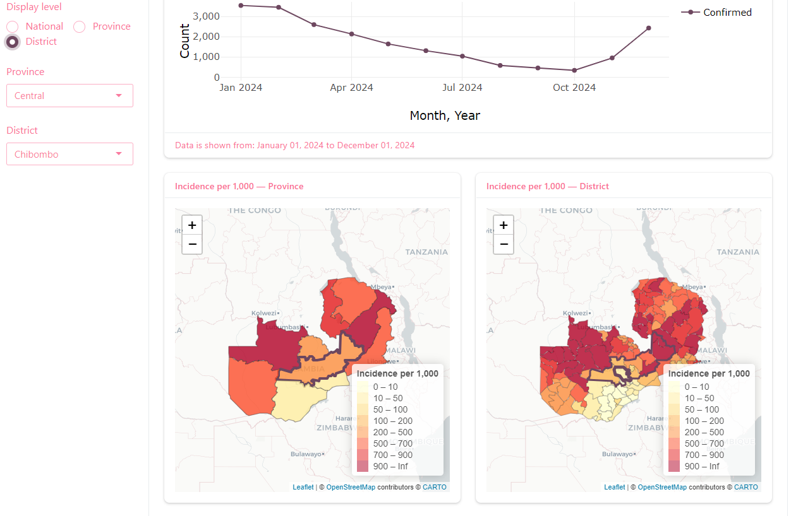

Your maps now acknowledge and emphasize the user’s selection!

# Next Steps and Extensions

While we have covered a broad range of features, this only scratches the surface of what you can build with Shiny. Below are some suggested areas to explore next as you continue developing your Shiny skills.

## Expanding Functionality

-   Add additional filters such as date ranges or multiple administrative levels

-   Build more complex plots, for example:

    -   Adding trendlines or smoothing

    -   Faceting across multiple provinces

    -   Allowing users to interactively select multiple indicators for comparison

-   Add more text explanations or info popups to your dashboard

-   Add input widgets that allow the user to look at the highest or lowest ranking incidence areas

-   Build in tabular data summaries

-   Allow for data downloads

-   Build drill-down functionality to explore facility-level data

-   Automated data pulls into your dashboard

## Organizing and Scaling Your Code

As dashboards become more complex, managing code in a single app file can become difficult. You may want to:

-   Split your code into multiple files, separating UI, server, and helper functions

-   Use modular design with `callModule()` or `moduleServer()` to create reusable components

-   Build centralized helper functions in a dedicated script (e.g., `helpers.R`) and source this at the top of your `app.R` file to keep things clean.

This makes your code easier to maintain and scale over time.

## Deployment and Sharing

There are multiple options for sharing Shiny dashboards:

-   Running locally for personal or internal use (what we did today)

-   Publishing to cloud services such as [shinyapps.io](https://www.shinyapps.io/) (free options)

-   Deploying on enterprise platforms such as Posit Connect (\$\$)

-   Hosting internally on government or institutional servers

When deploying dashboards, consider whether your data includes any sensitive or confidential information. Secure hosting, access controls, and user authentication may be required depending on your intended audience.

For more information on hosting check out this [Shiny article](https://shiny.posit.co/r/deploy.html).

## Styling and User Experience

In addition to the core functionality, improving the design and appearance of your dashboard can make it easier to use:

-   Customize your `bslib` themes to align with institutional branding

-   Provide users with contextual help such as pop-up modals or collapsible panels to explain indicators or methods

-   Use dynamic tooltips, colour schemes, or alert messages to highlight important information

## Useful Resources for Further Learning

-   [Shiny Official Documentation](https://shiny.posit.co/)

-   [Mastering Shiny by Hadley Wickham](https://mastering-shiny.org/) (free online book)

-   [bslib Documentation](https://rstudio.github.io/bslib/) for theming

-   [Shiny Gallery](https://shiny.posit.co/r/gallery/) Examples for code samples
