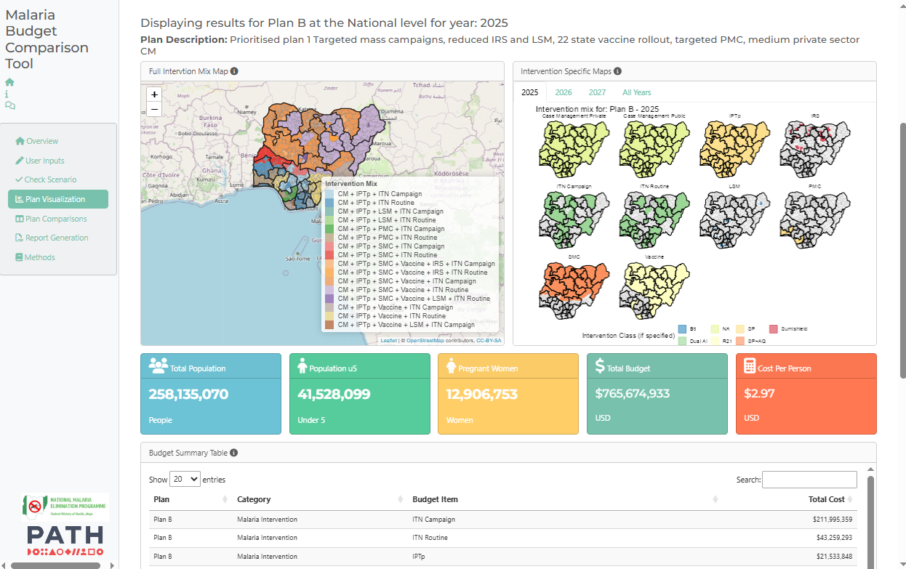
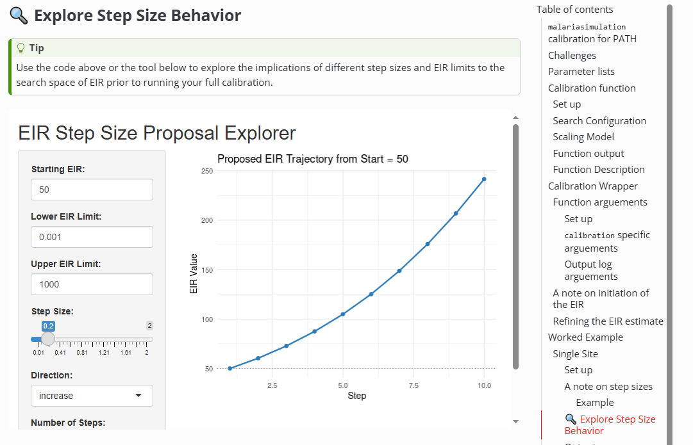
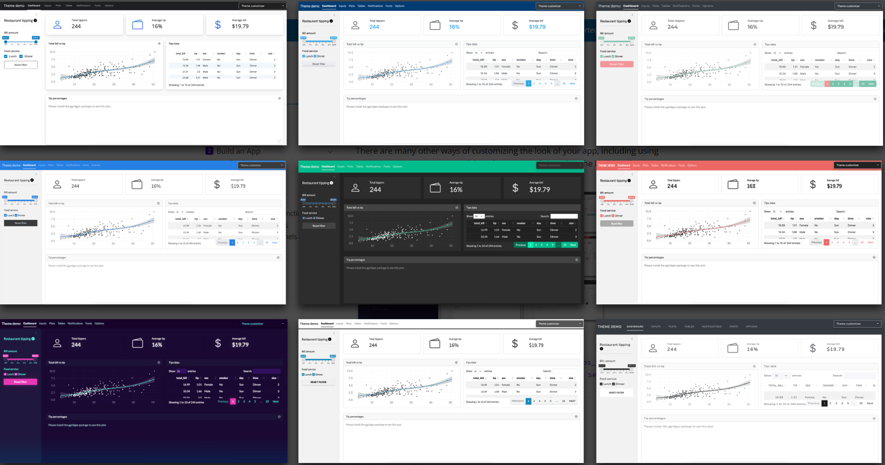

## 🎯 Session Objectives

::: {.fragment .fade-in}
### Shiny Dashboarding

-   Understand key elements and structure of a Shiny dashboard (UI, Server, and reactive logic).

-   Gain hands-on experience customizing dashboards using the bslib package.

-   Build interactive plots, tables, and maps using packages like plotly, DT, and leaflet.

-   Create your own Shiny dashboard to visualize malaria surveillance data.

-   Understand how Quarto and Shiny can be combined to build integrated, interactive reporting tools.
:::

------------------------------------------------------------------------

## What is a Dashboard?

::: incremental
-   A dashboard is a visual interface for exploring and interacting with data.
-   Shiny lets you build dashboards *directly in R* --- no web development needed!
:::

------------------------------------------------------------------------

## Why Use Shiny?

::: incremental
✅ Turns R code into interactive web apps\
✅ You don't need to learn HTML, CSS, or JavaScript\
✅ Great for sharing visualizations, tables, and summaries\
✅ Easy to deploy: share with collaborators or host online\
✅ Allow non R users to interact and explore data without the need to code.\
✅ Provide analytical capacity to people without analytical skills\
✅ Shiny is a lot more flexible that DHIS2 modules
:::

------------------------------------------------------------------------

## Challenges

::: incremental
🛑 Need an R coding background\
🛑 Can be more complext than normal R scripts\
🛑 Can be costs to hosting apps for distribution
:::

------------------------------------------------------------------------

## Examples of Dashboards

Shiny dashbaords can grow to be incredibly complex web applications but can also be small simple tools designed to help colleagues with everyday tasks and problems. Here are two examples of dashboards we've created recently at PATH.

::::: columns
::: {.column width="50%"}

:::

::: {.column width="50%"}

:::
:::::

------------------------------------------------------------------------

## 🦵💪 Anatomy of a Shiny App

A basic Shiny app has **two main parts**:

1.  **UI (User Interface)** -- what the user sees and interacts with (*frontend*)
2.  **Server** -- what R does behind the scenes - computations and tasks based on the user inputs (*backend*)

``` r
library(shiny)
library(bslib)

# Define UI ----
ui <- fluid_page(
 # Define the layout
 # Define the theme 
 # Define user input selection
 # Define types of outputs
)

# Define server logic ----
server <- function(input, output) {
# Computations 
}

# Run the app ----
shinyApp(ui = ui, server = server)
```

This code is the bare minimum needed to create a Shiny app. The result is an empty app with a blank user interface.

------------------------------------------------------------------------

##  {background-iframe="https://shiny.posit.co/r/layouts/" background-interactive="True"}

------------------------------------------------------------------------

##  {background-iframe="https://shiny.posit.co/r/components/" background-interactive="True"}

------------------------------------------------------------------------

## 🎨 Theming

Customizing the theme of your dashboard is a really simple way to upgrade the look and feel of your app.

::::: columns
::: {.column width="50%"}

:::

::: {.column width="50%"}
You can use the `{bslib}` package to easily:

-   Change colors, fonts, and spacing

-   Apply modern Bootstrap themes (like `flatly`, `minty`, `cosmo`)

-   Preview changes live while building your app
:::
:::::

::: {.fragment .fade-in}
> We'll explore this in more detail later --- for now, just know it's easy to give your dashboard a polished, professional look!
:::

------------------------------------------------------------------------

## 📦 Helpful Packages

-   `shiny` -- the core package

-   `bslib` -- for modern dashbaord design

-   `tidyverse` -- for data wrangling

-   `DT` -- for interactive tables

-   `plotly` -- for interactive plots

-   `leaflet` - for open source interactive maps

------------------------------------------------------------------------

## 🌐 Helpful Webpages for Getting Started with Shiny

Below are some beginner-friendly resources to help you dive deeper into Shiny:

| Link | Description |
|------------------------------------|------------------------------------|
| [Shiny Get Started](https://shiny.posit.co/r/getstarted/) | Official step-by-step tutorial for beginners, with hands-on examples. |
| [Shiny Gallery](https://shiny.posit.co/r/gallery/) | Explore live examples of Shiny apps with source code. |
| [Mastering Shiny (book)](https://mastering-shiny.org/) | Free online book by Hadley Wickham covering basics to advanced topics. |
| [Shiny Cheatsheet](https://posit.co/resources/cheatsheets/) | Handy reference for Shiny functions and UI elements (download the PDF). |
| [Shiny UI Editor (Experimental)](https://shiny.posit.co/r/editor/) | Drag-and-drop interface to design your UI visually. |

::: {.fragment .fade-in}
> These links are a great place to start exploring after today’s session.
:::

------------------------------------------------------------------------

## What You'll Build Today: An R Shiny dashboard to visualize routine malaria data

-   Clean and summarize key indicators ✔

-   Build simple interactive plots and tables 🔃

-   Customize 🔃

------------------------------------------------------------------------

## Key Takeaways

::: incremental
-   Shiny makes dashboards easy to build in R

-   You'll learn by doing --- today is all about hands-on practice

-   You'll work with a template and build out each element of the dasboard

-   We'll go step-by-step 🛠️
:::

------------------------------------------------------------------------
